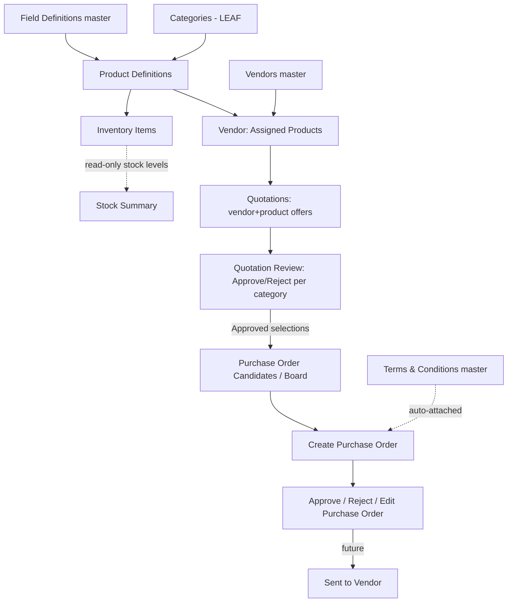
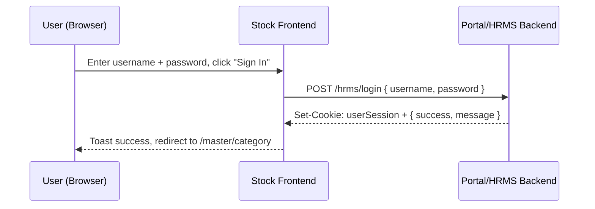
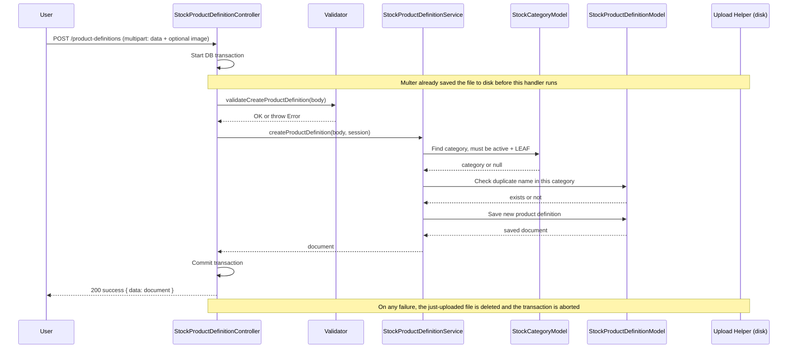
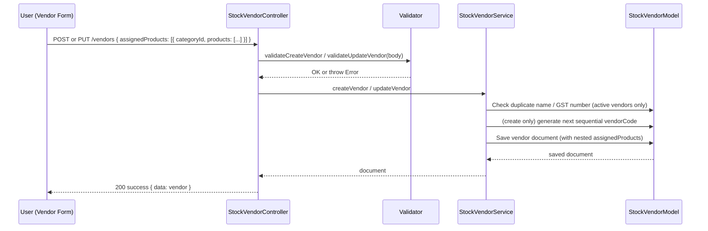
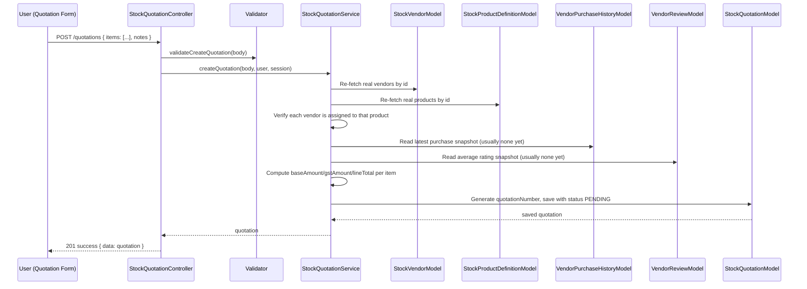
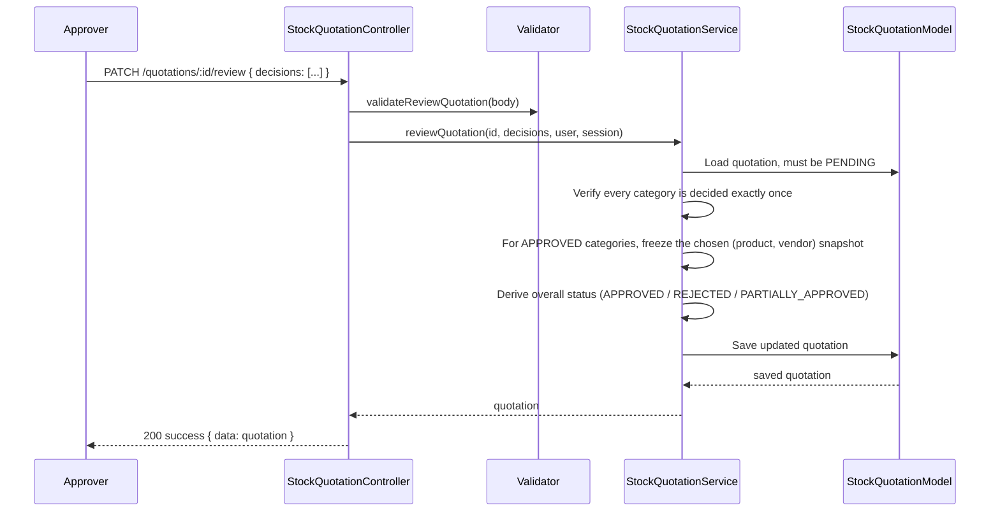
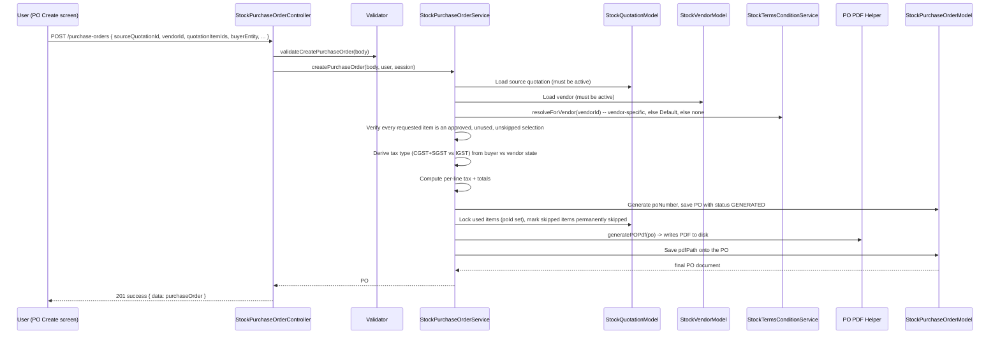

# Stock Backend — Complete Documentation

This document explains the entire "Stock" backend project in plain, simple English. It is written so
that anyone — a non-technical person, an intern, a fresher, or a new developer — can understand what
this system does, how it is built, and how every piece of it works, **without needing to read the
source code first**.

---

# 1. Project Overview

## 1.1 Project Name
**Stock Backend** (folder name: `stock-backend`, npm package name: `stock-backend`)

## 1.2 What is this project for?
This is the backend (server) part of a **Stock / Inventory / Procurement management system**. It is
one module of a larger company system (an ERP — Enterprise Resource Planning suite that also has HRMS,
Sales, NOC, CRM, etc.). This particular module handles everything related to:

- Defining **categories** of products (like a folder tree: Mobiles > Smartphones > Poco).
- Defining **field definitions** — the extra pieces of information a product can have (like RAM,
  Storage, IMEI Number, Color).
- Defining **product definitions** — the actual "product types" a company deals in (like "Poco M2
  Pro"), including tax rate (GST), warranty, and unit of measurement.
- Recording **inventory items** — the real physical stock, either tracked one-by-one (serial number /
  IMEI) or tracked as a bulk quantity.
- Maintaining a **vendor** master (suppliers): their GST details, contacts, address, bank accounts, and
  which products they can supply.
- Creating **quotations** — asking multiple vendors for prices on products, then having someone approve
  or reject the best offer per category.
- Generating **purchase orders (PO)** from approved quotations, including GST calculation and a
  printable PDF.
- Maintaining a **Terms & Conditions** master that gets automatically attached to a purchase order.

In short: this backend is the "brain" behind buying stock from vendors — from defining what a product
is, to asking for quotes, approving the best one, and creating the official purchase order document.

## 1.3 Folder Structure (short explanation)

The real project code lives in a **nested folder**:
```
stock-backend/                 <- outer folder (has only a CLAUDE.md guidance file)
  stock-backend/                <- INNER folder — this is the actual project
    app.js                      <- server entry point
    package.json
    .env                        <- environment variables (secrets/config)
    routes/                     <- URL definitions (which URL calls which controller)
    controllers/                <- receives the HTTP request, calls the service, sends the response
    services/                   <- all business logic and database queries live here
    models/                     <- MongoDB/Mongoose schemas (data shape)
    validators/                 <- checks that incoming request data is valid
    helpers/                    <- small reusable utilities (pagination, logging, PDF, file upload)
    constants/                  <- fixed lists of allowed values (enums)
    seeders/                    <- one-time scripts to pre-fill the database
    uploads/                    <- uploaded product images/PDFs are stored here
    public/                     <- generated Purchase Order PDFs are stored here
```

All commands (`npm start`, `npm run seed`, etc.) must be run from the **inner** `stock-backend/stock-backend/`
folder, not the outer one.

## 1.4 Tech Stack

| Layer | Technology |
|---|---|
| Language | JavaScript (Node.js, ES Modules — `"type": "module"` in package.json) |
| Web framework | Express.js v4 |
| Database | MongoDB |
| ODM (database layer) | Mongoose v8 |
| File uploads | Multer v2 |
| PDF generation | PDFKit |
| Environment config | dotenv |
| Cross-origin requests | cors |
| Process manager (production) | PM2 (via `npm run pm2:start`) |

There is **no** test framework, **no** linter configuration, and **no** build step — this is a plain
Node.js server that runs directly with `node app.js`.

## 1.5 Server Entry Point
`app.js` (inner `stock-backend/stock-backend/app.js`). This single file:
1. Loads environment variables (`dotenv.config()`).
2. Creates the Express app.
3. Turns on CORS (allows requests from any origin, with credentials).
4. Turns on JSON body parsing (`express.json()`).
5. Serves the `uploads/` folder publicly at the URL path `/uploads`.
6. Adds a health-check route (`GET /`) that returns `{ status: "Stock API running" }`.
7. Mounts all Stock APIs under `/api/v1/stock`.
8. Adds a catch-all 404 handler for unknown routes.
9. Connects to MongoDB, and only after the connection succeeds, starts listening on the configured port.

There is also a `ROUTE_REGISTRATION.js` file at the project root — this is **not executable code**, it
is a plain comment/instruction file explaining how to plug this stock module's routes into a larger,
shared Express app (in case this module needs to be merged into a bigger backend later). It also
documents how to run the field-definition seeder on startup.

## 1.6 Database Used
**MongoDB**, accessed through **Mongoose**. The connection string comes from the `MONGO_URI` environment
variable. There are **10 collections** (one per Mongoose model) — see the [Database Schemas](#3-database-schemas)
section for full detail on every one of them.

## 1.7 Authentication Method
There is **no authentication middleware built into this backend module** (no JWT verification, no login
route, no session check anywhere in this codebase). The controllers only *read* an already-authenticated
user's identity from the request, using:
```js
req.user?._id ?? req.userId ?? null       // "who is doing this action" (used for createdBy/updatedBy/deletedBy)
req.user?.name ?? req.user?.fullName ?? "" // display name, saved alongside the id
```
This means the actual login/authentication is expected to happen **somewhere upstream** — for example
in a shared gateway, or in the parent app that this module gets registered into (see
`ROUTE_REGISTRATION.js`). In the current standalone version, `req.user` / `req.userId` are always
`undefined`, so every "who did this" field is stored as `null` — there is no real login flow inside this
repository. (The actual login screen the user interacts with belongs to the **frontend**, and talks to a
completely separate **HRMS/portal backend** — see [Authentication Flow](#9-authentication-flow) below
for how that connects.)

## 1.8 File Upload Method
**Multer** (disk storage). Used only for **Product Definition** images/attachments:
- Files are saved to `uploads/stock/products/` on the server's disk.
- Allowed types: JPG, JPEG, PNG, WEBP images, or PDF files.
- Maximum size: 5 MB.
- The file is renamed to `product_<timestamp>_<random>.<original-extension>`.
- The database only stores a relative **public path** like `/uploads/stock/products/product_123.jpg`,
  never the real file system path.
- These files are served back to the browser via the static route `/uploads` set up in `app.js`.

There is a **second, separate** file-writing mechanism (not an upload, but file generation): **Purchase
Order PDFs**, written by PDFKit to `public/uploads/stock/po/<PO-NUMBER>.pdf` and streamed back to the
browser through a dedicated download/view route.

## 1.9 Cron Jobs
**None.** There is no `cron` folder and no scheduled/recurring job anywhere in this codebase.

## 1.10 Sockets
**None.** No WebSocket / Socket.IO code exists in this backend.

## 1.11 Third-Party Services
- None called directly from this backend. (On the **frontend** side, GST verification is currently a
  fully mocked/simulated function, and the "internal companies/buyer entity" list is fetched from a
  public GitHub Gist as a temporary stand-in for a real internal API — these are frontend-only stubs,
  not backend integrations.)

## 1.12 Environment Variables

| Variable | Purpose (no real values shown) |
|---|---|
| `MONGO_URI` | The MongoDB connection string the server connects to on startup. |
| `PORT` | The port the Express server listens on (defaults to `5000` if not set). |
| `NODE_ENV` | Set to `development` or `production`. When `development`, error responses include the full stack trace for easier debugging; in any other value, the stack trace is hidden from the client. |

---

# 2. Complete Module List

| Module | Description | APIs | Schema | Status |
|---|---|---|---|---|
| Field Definitions | Admin-defined reusable "dynamic attribute" catalog (RAM, Storage, IMEI, Color, etc.) that product definitions attach to. | 6 | `stock.field.definition.model.js` | Active |
| Categories | Hierarchical (tree) product categories — GROUP (folder) or LEAF (terminal, can hold products). | 10 | `stock.category.model.js` | Active |
| Product Definitions | The catalog/template layer — a "type" of product with GST rate, unit, warranty, tracking method, optional image/PDF attachment, and a chosen set of dynamic fields. | 8 | `stock.product.definition.model.js` | Active |
| Vendors | Supplier master — GST info, multiple contacts, address, assigned products (per category), multiple bank accounts. | 6 | `stock.vendor.model.js` | Active |
| Terms & Conditions | Library of rich-text T&C blocks for Purchase Orders — one may be "Default", others scoped to specific vendors. | 7 | `stock.terms.condition.model.js` | Active |
| Inventory Items | The actual physical stock records (serialized or bulk-quantity), with dynamic field values and a physical status (Available/Allocated/etc). | 9 | `stock.inventory.item.model.js` | Active |
| Quotations | Per-category vendor price quotes; approver decides Approve/Reject per category; feeds Purchase Orders. | 11 | `stock.quotation.model.js` | Active |
| Purchase Orders | Generated from approved quotation selections; computes GST split (CGST+SGST vs IGST); produces a PDF; has an approve/reject review step. | 10 | `stock.purchase.order.model.js` | Active |
| Vendor Purchase History | Records past purchases per (vendor, product) — **write path not built yet**; only read today (by Quotation, to show "previous price/qty"). | 0 (no routes) | `stock.vendor.purchase.history.model.js` | Read-only stub, future-write |
| Vendor Reviews | Records vendor ratings per (vendor, product) — **write path not built yet**; only read today (by Quotation, to compute average rating). | 0 (no routes) | `stock.vendor.review.model.js` | Read-only stub, future-write |

Total: **8 modules with live APIs** (67 endpoints), plus **2 "future-write" data models** that already
exist in the database schema and are actively read from, but have no create/update API yet.

---

# 3. Database Schemas

All models are defined with Mongoose. Every model explicitly pins its MongoDB collection name as the
3rd argument to `mongoose.model()` — so there is never any guessing/pluralization magic. Every
business schema (except the two read-only history/review ones, which still have `isActive`/soft-delete
fields but no delete API yet) follows the same **soft-delete convention**: `isActive` (Boolean,
default `true`), `deletedAt` (Date), `deletedBy` (ObjectId). Nothing is ever hard-deleted from the
database by this backend.

## 3.1 Category (`categories` collection)

**File:** `models/stock.category.model.js`
**Purpose:** Represents one node in the product category tree. A category is either a `GROUP` (a
folder that can contain other categories) or a `LEAF` (a terminal category that can hold actual
products, but cannot have children).
**Collection name:** `categories`

**Indexes:**
- `{ parentId: 1 }` — fast lookup of a category's children.
- `{ path: 1 }` — fast lookup of descendants (used when moving a category).
- `{ isActive: 1, type: 1 }` — fast filtering by active state + type.
- `{ name: 1 }` **unique**, case-insensitive, but only applied to **active** categories
  (`partialFilterExpression: { isActive: true }`). This means two active categories can never share a
  name (regardless of case), but a soft-deleted category's old name does **not** block reusing that
  name for a brand-new category.

**Relationships:**
- `parentId` → another `categories` document (self-referencing tree). `null` means this is a root
  category.
- Product Definitions reference a Category via `categoryId` (only LEAF categories can be referenced).
- Vendors reference Categories inside `assignedProducts[].categoryId`.

**Fields:**

| Field | Type | Required | Default | Enum | Description |
|---|---|---|---|---|---|
| `name` | String | Yes | — | — | The category's display name (e.g. "Smartphones"). Trimmed automatically. |
| `description` | String | No | `""` | — | Optional free-text description. |
| `type` | String | Yes | — | `GROUP`, `LEAF` | GROUP = can have sub-categories; LEAF = terminal, can hold products. Cannot be changed on plain update — only via the dedicated "toggle type" API. |
| `parentId` | ObjectId | No | `null` | — | Points to the parent category. `null` = root-level category. |
| `path` | String | Yes | — | — | A "breadcrumb of IDs" like `/id1/id2/id3/`, used to quickly find all descendants of a category. |
| `sortOrder` | Number | No | `0` | — | Controls the display order among sibling categories. |
| `isActive` | Boolean | No | `true` | — | Soft-delete flag. |
| `deletedAt` | Date | No | `null` | — | When it was soft-deleted. |
| `deletedBy` | ObjectId | No | `null` | — | Who soft-deleted it. |
| `createdAt` / `updatedAt` | Date | — | auto | — | Added automatically by Mongoose (`timestamps: true`). |

**Virtuals / Hooks / Statics / Methods / Plugins:** None defined on the schema itself — all "computed"
values (like `displayPath` and `childCount`) are built in the **service layer** at read time, not stored
on the document.

---

## 3.2 Field Definition (`field_definitions` collection)

**File:** `models/stock.field.definition.model.js`
**Purpose:** Defines one reusable "dynamic attribute" that can later be attached to a Product
Definition — for example "RAM", "IMEI Number", "Color". This drives dynamic, per-product custom input
forms without needing a new database column for every possible attribute.
**Collection name:** `field_definitions`

**Indexes:**
- `{ code: 1 }` unique.
- `{ isActive: 1 }`.

**Relationships:**
- Product Definitions reference this via `selectedFields[].fieldDefId`.
- Inventory Items store actual values for these fields inside a free-form `fieldValues` map, keyed by
  this field's `code`.

**Fields:**

| Field | Type | Required | Default | Enum | Description |
|---|---|---|---|---|---|
| `code` | String | Yes, unique | — | — | Machine-readable key (e.g. `ram`, `imei`). Forced lowercase, must be snake_case (validated). **Immutable** after creation. |
| `label` | String | Yes | — | — | Human-readable display name (e.g. "RAM"). |
| `order` | Number | No | `0` | — | Controls display order in forms. |
| `inputType` | String | Yes | — | `text`, `textarea`, `number`, `decimal`, `dropdown`, `multi_select`, `date`, `datetime`, `boolean`, `color` | What kind of input control this field should render as. |
| `optionsSource` | String | No | `null` | — | A key that (elsewhere) resolves to a list of dropdown options — required only when `inputType` is `dropdown` or `multi_select`. |
| `isRequired` | Boolean | No | `false` | — | If true, any product using this field must supply a value for it when creating an inventory item. |
| `isFilterable` | Boolean | No | `false` | — | Marks this field as usable in list-filtering UI (informational flag; not enforced by any API filter today). |
| `isActive` | Boolean | No | `true` | — | Soft-delete flag. |
| `deletedAt` / `deletedBy` | Date / ObjectId | No | `null` | — | Soft-delete audit fields. |

---

## 3.3 Product Definition (`product_definitions` collection)

**File:** `models/stock.product.definition.model.js`
**Purpose:** The "catalog" or "template" for one type of product a company deals in (e.g. "Poco M2
Pro 6/128GB"). This is not the physical stock itself — it's the definition that inventory items point
back to.
**Collection name:** `product_definitions`

**Indexes:**
- `{ categoryId: 1, isActive: 1 }`
- `{ trackingMethod: 1 }`
- `{ name: 1 }`
- (Enforced in the service layer, not as a raw index) case-insensitive duplicate-name check scoped to
  the same category.

**Relationships:**
- `categoryId` → Category (must be a **LEAF** category).
- `selectedFields[].fieldDefId` → Field Definition (many-to-many, each with its own `order` and
  `isRequired` override).
- Referenced by Inventory Items (`productDefinitionId`), Vendors (`assignedProducts[].products[].productId`),
  Quotation line items, and Purchase Order line items.

**Fields:**

| Field | Type | Required | Default | Enum | Description |
|---|---|---|---|---|---|
| `categoryId` | ObjectId | Yes | — | — | The LEAF category this product belongs to. Cannot be changed after creation. |
| `name` | String | Yes | — | — | The product's display name. Must be unique within its category (case-insensitive). |
| `trackingMethod` | String | Yes | — | `individual`, `quantity` | `individual` = every physical unit is tracked separately (e.g. by IMEI); `quantity` = only a bulk count is tracked. |
| `selectedFields` | Array of `{ fieldDefId, isRequired, order }` | No | `[]` | — | Which Field Definitions apply to this product, in what order, and whether each is mandatory for this specific product. |
| `gstRate` | String | No | `null` | `0`,`5`,`12`,`18`,`28` | The GST tax percentage applied when this product is quoted/ordered. |
| `unit` | String | No | `null` | `pieces`,`meter`,`kg`,`box`,`litre`,`dozen` | Unit of measurement. |
| `stockAlertThreshold` | Number | No | `null` | — | Minimum quantity at/below which a stock alert should trigger (display-only today, not enforced by an alert system in this backend). |
| `warrantyYears` | Number | No | `null` | — | Default manufacturer warranty in years. Vendors can override this per-assignment; enforced as **required at the API layer** (not at the schema layer, to avoid breaking old documents on unrelated saves — see the "Business Logic" section for why). |
| `image` | String | No | `null` | — | Relative public path to the uploaded image/PDF attachment. |
| `status` | String | No | `ACTIVE` | `ACTIVE`, `DRAFT` | Whether this definition is considered live/usable, or still being drafted. |
| `isActive` / `deletedAt` / `deletedBy` | Boolean/Date/ObjectId | No | soft-delete defaults | — | Standard soft-delete fields. |

---

## 3.4 Inventory Item (`inventory_items` collection)

**File:** `models/stock.inventory.item.model.js`
**Purpose:** Represents actual physical stock the company owns — either one serialized unit
(individual tracking) or a bulk quantity record (quantity tracking).
**Collection name:** `inventory_items`

**Indexes:**
- `{ productDefinitionId: 1, isActive: 1 }`
- `{ vendorId: 1 }`
- `{ status: 1 }`
- `{ "fieldValues.imei": 1 }` sparse
- `{ "fieldValues.serial_no": 1 }` sparse

**Relationships:**
- `productDefinitionId` → Product Definition (required).
- `vendorId` → Vendor (optional — who this stock was received from; reserved for a future "Inventory
  Receive" module).

**Fields:**

| Field | Type | Required | Default | Enum | Description |
|---|---|---|---|---|---|
| `productDefinitionId` | ObjectId | Yes | — | — | Which product type this physical stock is. |
| `vendorId` | ObjectId | No | `null` | — | Who supplied this stock (reserved for future use). |
| `status` | String | No | `AVAILABLE` | `AVAILABLE`,`ALLOCATED`,`IN_REPAIR`,`SCRAPPED`,`IN_TRANSIT` | Current physical/lifecycle status of this stock. |
| `fieldValues` | Mixed (free-form object) | No | `{}` | — | Stores the actual value for each of the product's dynamic fields, keyed by field `code` (e.g. `{ imei: "3549...", color: "Black" }`). |
| `quantity` | Number | No | `null` | — | Used only when the product's `trackingMethod` is `quantity`; `null` for individually-tracked items. |
| `receivedAt` | Date | Yes | — | — | When this stock was received. |
| `receivedBy` | ObjectId | No | `null` | — | Who recorded the receipt. |
| `isActive` / `deletedAt` / `deletedBy` | — | No | soft-delete defaults | — | Standard soft-delete fields. |

---

## 3.5 Vendor (`vendors` collection)

**File:** `models/stock.vendor.model.js`
**Purpose:** The supplier master — everything needed to know about a vendor: identity, GST status,
who to contact, where they are, what they're approved to supply, and where to pay them.
**Collection name:** `vendors`

**Indexes:**
- `{ name: 1 }`
- `{ vendorCode: 1 }` unique, **partial** — only indexes documents where `vendorCode` is an actual
  string (fixes a historical bug where storing `null` under a `sparse` index still caused duplicate-key
  errors).
- `{ "gst.gstNumber": 1 }` sparse.
- `{ isActive: 1 }`.
- `{ "assignedProducts.categoryId": 1 }` and `{ "assignedProducts.products.productId": 1 }` — fast
  filtering of vendors by category/product for picker dropdowns.

**Sub-documents (embedded schemas, not separate collections):**
- `stateSchema` — `{ key, name, code }` (e.g. `HR` / `Haryana` / `06`), reused for GST state, address
  state, and bank state.
- `gstSchema` — GST availability + number + verified flag + auto-filled legal/trade name/address/state
  once GST is "verified".
- `contactSchema` — one labeled contact (name/email/phone/designation/department). A vendor has an
  array of these; one must be labeled `PRIMARY`.
- `addressSchema` — full address, area, city, pin code, state.
- `assignedProductSchema` — one entry per category the vendor supplies, containing an array of
  `assignedProductEntrySchema` (`productId` + per-product `overrides`, currently only `warrantyYears`).
- `bankAccountSchema` — one labeled bank account (IFSC, bank name, branch, account number, etc.). One
  must be labeled `PRIMARY`.

**Relationships:**
- `assignedProducts[].categoryId` → Category.
- `assignedProducts[].products[].productId` → Product Definition.
- Referenced by Quotation items, Purchase Orders, Vendor Purchase History, Vendor Reviews.

**Fields (top level):**

| Field | Type | Required | Default | Description |
|---|---|---|---|---|
| `name` | String | Yes | — | Vendor's company name. |
| `vendorCode` | String | No (server-generated) | — | Auto-generated, sequential (e.g. `VEN0001`), unique when present, **immutable** once set. Client-supplied values are ignored. |
| `vendorAlias` | String | No | `""` | Short display alias. |
| `gst` | `gstSchema` | No | `{}` | GST block (see above). |
| `panNumber` | String | No | `""` | PAN number. |
| `paymentTerms` | String | Yes | — | Free-text/enum-like payment term (frontend-defined list, not DB-enforced). |
| `notes` | String | No | `""` | Free text; also doubles as the "blacklist/inactive reason" once a vendor is deactivated. |
| `contacts` | Array of `contactSchema` | No | `[]` | Must include one `PRIMARY` contact (enforced in the validator). |
| `address` | `addressSchema` | No | `{}` | Vendor's address. |
| `assignedProducts` | Array of `assignedProductSchema` | No | `[]` | Which products (by category) this vendor is approved to supply. |
| `bankAccounts` | Array of `bankAccountSchema` | No | `[]` | Must include one `PRIMARY` bank account. |
| `isActive` / `deletedAt` / `deletedBy` | — | No | soft-delete defaults | Standard soft-delete fields. |

---

## 3.6 Terms & Conditions (`terms_conditions` collection)

**File:** `models/stock.terms.condition.model.js`
**Purpose:** A library of reusable rich-text (HTML) terms-and-conditions blocks that get automatically
attached to a Purchase Order at creation time.
**Collection name:** `terms_conditions`

**Indexes:**
- `{ isDefault: 1 }`
- `{ applicableVendors: 1 }`
- `{ isActive: 1, status: 1 }`
- `{ isDefault: 1 }` **unique**, partial (`isDefault: true, isActive: true`) — guarantees at most one
  active "Default" term can exist at the database level, backing up the same rule enforced in the
  service layer.

**Relationships:**
- `applicableVendors[]` → Vendor (many-to-many; ignored/cleared when `isDefault` is true).
- Referenced by Purchase Orders via `termsConditionId` (a point-in-time snapshot, not a live reference).

**Fields:**

| Field | Type | Required | Default | Enum | Description |
|---|---|---|---|---|---|
| `termName` | String | Yes | — | — | Display name for this T&C block (e.g. "Standard Import Terms"). |
| `isDefault` | Boolean | No | `false` | — | If true, this term applies to any vendor that has no vendor-specific term. Only one active term can be default at a time. |
| `applicableVendors` | Array of ObjectId | Required only when `isDefault` is false | `[]` | — | Which specific vendors this term applies to. |
| `termsContent` | String (HTML) | Yes | — | — | The actual rich-text terms content, sanitized on save (script/style tags and inline event handlers stripped) before storage. |
| `status` | String | No | `ACTIVE` | `ACTIVE`, `INACTIVE` | A separate "is this term currently usable" flag, on top of the soft-delete `isActive`. |
| `isActive` / `deletedAt` / `deletedBy` | — | No | soft-delete defaults | — | Standard soft-delete fields. |

---

## 3.7 Quotation (`quotations` collection)

**File:** `models/stock.quotation.model.js`
**Purpose:** Represents a request for vendor pricing across one or more categories. Contains a pool of
priced (vendor, product) offers; an approver later picks exactly one winning offer per category.
**Collection name:** `quotations`

**Indexes:** `{ status: 1, isActive: 1 }`, `{ quotationNumber: 1 }` unique sparse, `{ categoryIds: 1 }`,
`{ "items.vendorId": 1 }`, `{ "items.productDefinitionId": 1 }`,
`{ "categoryApprovals.selections.vendorId": 1 }`, `{ createdBy: 1 }`.

**Sub-documents:**
- `quotationLineItemSchema` (`items[]`) — one row per (product, vendor) offer, with quantity, unit
  price, GST rate, computed totals, warranty snapshot, "previous purchase" and "average rating"
  snapshots (read from the two future-write collections), an `isApproved` flag, and a set of "PO board"
  tracking fields (`poId`, `poSkipped`, etc. — used once the item flows into Purchase Order creation).
- `categorySelectionSchema` — a frozen snapshot of one winning offer, stored inside a category's
  approval record.
- `categoryApprovalSchema` (`categoryApprovals[]`) — one decision per category: `APPROVED` or
  `REJECTED`, remarks, who decided it and when, and (if approved) the winning `selections[]`.
- `disabledVendorSchema` (`disabledVendors[]`) — vendors an admin has manually excluded from the
  Purchase Order flow for this specific quotation, with a mandatory reason.

**Relationships:**
- `items[].productDefinitionId` → Product Definition, `items[].vendorId` → Vendor,
  `items[].categoryId` → Category.
- `categoryApprovals[].selections[].itemId` → one of this document's own `items[]._id`.
- Read by Purchase Order creation (`sourceQuotationId` on the PO points back here).

**Fields (top level):**

| Field | Type | Required | Default | Enum | Description |
|---|---|---|---|---|---|
| `quotationNumber` | String | No (server-generated) | `null` | — | Auto-generated sequential number like `QTN-2026-0001`. |
| `status` | String | No | `PENDING` | `PENDING`,`APPROVED`,`PARTIALLY_APPROVED`,`REJECTED` | **Derived, never set directly** — computed from the mix of category decisions (see Business Logic). |
| `categoryIds` | Array of ObjectId | — | — | — | Every distinct category referenced by `items[]`. |
| `items` | Array of `quotationLineItemSchema` | Must be non-empty | — | — | The full pool of vendor/product price offers. |
| `categoryApprovals` | Array of `categoryApprovalSchema` | No | `[]` | — | Filled in all at once when the approver submits a review. |
| `disabledVendors` | Array of `disabledVendorSchema` | No | `[]` | — | Vendors excluded from PO creation for this quotation. |
| `notes` | String | No | `""` | — | Free text. |
| `createdBy` / `createdByName` | ObjectId / String | No | `null` / `""` | — | Who created the quotation. |
| `updatedBy` / `updatedByName` | ObjectId / String | No | `null` / `""` | — | Who last updated/reviewed it. |
| `isActive` / `deletedAt` / `deletedBy` | — | No | soft-delete defaults | — | Standard soft-delete fields. |

---

## 3.8 Purchase Order (`purchase_orders` collection)

**File:** `models/stock.purchase.order.model.js`
**Purpose:** The official purchase order document generated from one vendor's approved quotation
selections. Snapshots everything (vendor details, buyer entity, terms, prices, GST) so the PO never
changes even if the source vendor/quotation data changes later.
**Collection name:** `purchase_orders`

**Indexes:** `{ poNumber: 1 }` unique sparse, `{ sourceQuotationId: 1 }`, `{ vendorId: 1 }`,
`{ status: 1, isActive: 1 }`.

**Sub-documents:**
- `buyerEntitySchema` — a frozen snapshot of the internal company/entity this PO is being raised for
  (name, GST number, address, state).
- `poItemSchema` (`items[]`) — one PO line item, copied from an approved quotation selection, with GST
  split into CGST/SGST or IGST and a line total.

**Relationships:**
- `sourceQuotationId` → Quotation.
- `vendorId` → Vendor.
- `items[].quotationItemId` → the originating Quotation's `items[]._id`.
- `items[].productDefinitionId` / `items[].categoryId` → Product Definition / Category (display only,
  since everything needed is snapshotted directly onto the item).
- `termsConditionId` → Terms & Conditions (snapshot reference).

**Fields (top level):**

| Field | Type | Required | Default | Enum | Description |
|---|---|---|---|---|---|
| `poNumber` | String | No (server-generated) | `null` | — | Auto-generated sequential number like `PO-2026-0001`. |
| `sourceQuotationId` | ObjectId | No | `null` | — | Which quotation this PO was generated from. |
| `vendorId` | ObjectId | Yes | — | — | The supplier this PO is for. |
| `vendorName` / `vendorGstin` / `vendorAddress` / `vendorState` / `vendorStateCode` / `vendorPhone` / `vendorEmail` | String | No | `""` | — | Snapshot of the vendor's details at PO creation time. |
| `buyerEntity` | `buyerEntitySchema` | No | `{}` | — | Snapshot of the internal buying company. |
| `requester` | String | Yes (enforced by validator) | `""` | — | Name of the person requesting this PO. |
| `poDate` | Date | No | now | — | The date printed on the PO. |
| `shipmentPreference` | String | No | `""` | — | How the goods should be shipped (frontend-defined list). |
| `paymentTerms` | String | No | `""` | — | Snapshot copied from the vendor's `paymentTerms`. |
| `terms` | String (HTML) | No | `""` | — | Snapshot of the resolved Terms & Conditions rich text. **Immutable after create.** |
| `termsConditionId` | ObjectId | No | `null` | — | Which T&C document this snapshot came from. |
| `termsSource` | String | No | `NONE` | `VENDOR`,`DEFAULT`,`MANUAL`,`NONE` | How the terms were chosen — auto-matched to the vendor, fell back to the system Default, manually picked by the user, or none configured. |
| `notes` | String | No | `""` | — | Free text. |
| `taxType` | String | No | `IGST` | `CGST_SGST`,`IGST` | Which GST split applies, derived from whether buyer and vendor share the same state code. |
| `items` | Array of `poItemSchema` | No | `[]` | — | The priced line items. |
| `subTotal` / `cgstTotal` / `sgstTotal` / `igstTotal` / `gstTotal` / `grandTotal` | Number | No | `0` | — | Server-computed totals — client-sent totals are always ignored/recomputed. |
| `status` | String | No | `GENERATED` | `GENERATED`,`APPROVED`,`REJECTED`,`SENT` | Lifecycle status (see Business Logic for the flow). |
| `rejectedReason` | String | No | `""` | — | Reason entered when rejecting. |
| `reviewedBy` / `reviewedByName` / `reviewedAt` | ObjectId / String / Date | No | `null` / `""` / `null` | — | Who approved/rejected this PO, and when. |
| `pdfPath` | String | No | `""` | — | Relative public path to the generated PDF. |
| `emailedTo` / `emailedAt` | String / Date | No | `""` / `null` | — | Reserved for a future "email PO to vendor" feature — not implemented yet. |
| `createdBy` / `createdByName` / `updatedBy` / `updatedByName` | — | No | `null` / `""` | — | Audit fields. |
| `isActive` / `deletedAt` / `deletedBy` | — | No | soft-delete defaults | — | Standard soft-delete fields. |

---

## 3.9 Vendor Purchase History (`vendor_product_purchase_history` collection)

**File:** `models/stock.vendor.purchase.history.model.js`
**Purpose:** Meant to record every completed purchase from a vendor for a given product, so that the
Quotation screen can show "previous quantity" and "previous price" for context. **This collection is
currently only ever read, never written** — the write path belongs to a future "Inventory Receive"
module that has not been built yet. Until that exists, this collection stays empty and every quotation
line correctly shows "-" for these values.
**Collection name:** `vendor_product_purchase_history`

**Indexes:** `{ vendorId: 1, productDefinitionId: 1, purchaseDate: -1 }` — optimized for "get the
latest purchase for this vendor+product" which is the only query pattern used today.

**Fields:**

| Field | Type | Required | Default | Description |
|---|---|---|---|---|
| `vendorId` | ObjectId | Yes | — | Which vendor this purchase was from. |
| `productDefinitionId` | ObjectId | Yes | — | Which product was purchased. |
| `receivedQuantity` | Number | Yes | — | How much was received. |
| `purchasePrice` | Number | Yes | — | The unit price paid. |
| `purchaseDate` | Date | Yes | — | When it was received. |
| `sourceQuotationId` | ObjectId | No | `null` | Traces back to the quotation this purchase originated from, once such a link exists. |
| `createdBy` / `createdByName` | ObjectId / String | No | `null` / `""` | Audit fields. |
| `isActive` / `deletedAt` / `deletedBy` | — | No | soft-delete defaults | Standard soft-delete fields (present for consistency, unused today). |

---

## 3.10 Vendor Review (`vendor_reviews` collection)

**File:** `models/stock.vendor.review.model.js`
**Purpose:** Meant to record a rating (0–5) given to a vendor for a specific product, typically after a
delivery completes. **Also a read-only stub today** — Quotation reads this collection to compute an
average rating snapshot per (vendor, product), but nothing in this codebase writes a review yet.
**Collection name:** `vendor_reviews`

**Indexes:** `{ vendorId: 1, productDefinitionId: 1, isActive: 1 }` — supports the average-rating
aggregation.

**Fields:**

| Field | Type | Required | Default | Description |
|---|---|---|---|---|
| `vendorId` | ObjectId | Yes | — | Which vendor is being reviewed. |
| `productDefinitionId` | ObjectId | Yes | — | Which product the review is about. |
| `rating` | Number | Yes (0–5) | — | Star rating. |
| `comment` | String | No | `""` | Free-text review comment. |
| `createdBy` / `createdByName` | ObjectId / String | No | `null` / `""` | Audit fields. |
| `isActive` / `deletedAt` / `deletedBy` | — | No | soft-delete defaults | Standard soft-delete fields. |

---

# 4. API Documentation

All 67 endpoints are mounted under the base path **`/api/v1/stock`**. Every response follows the same
success/error envelope described in [Response Format](#7-response-format). Every mutating endpoint
(create/update/delete/restore/approve/reject/etc.) runs inside a **MongoDB transaction**
(`mongoose.startSession()` + `commitTransaction()`/`abortTransaction()`), so a failure partway through
always leaves the database unchanged.

## 4.1 Field Definition APIs

### Create Field Definition
- **Method / Route:** `POST /api/v1/stock/field-definitions`
- **Purpose:** Creates a new dynamic attribute (e.g. "RAM").
- **Request Body:**
  ```json
  {
    "code": "ram",
    "label": "RAM",
    "inputType": "dropdown",
    "optionsSource": "RAM_SIZES",
    "isRequired": false,
    "isFilterable": true,
    "order": 1
  }
  ```
- **Field Explanation:** `code` must be snake_case lowercase (letters/numbers/underscore only) and
  unique; `label` is the display name; `inputType` must be one of the 10 allowed input types;
  `optionsSource` is a free-text key resolved elsewhere for dropdown options; `isRequired`/`isFilterable`
  are booleans; `order` controls display order.
- **Success Response:** `201`-style success envelope (`200` status code with `success:true`) containing
  the created field definition document.
- **Error Responses:** `400` if `code`/`label`/`inputType` missing or invalid, or if a duplicate
  code/label exists (active or inactive — inactive duplicates suggest "restore instead").
- **Validation:** `validateCreateFieldDefinition` (validators file).
- **Authentication Required:** None enforced in this module (see [Authentication Flow](#9-authentication-flow)).
- **Permission Required:** None enforced in this module.
- **Business Rules:** Duplicate check runs against **both** active and inactive records — if it matches
  an inactive one, the error message tells the caller to restore it instead of creating a new duplicate.
- **Controller:** `StockFieldDefinitionController.createFieldDefinition`
- **Service:** `StockFieldDefinitionService.createFieldDefinition`
- **Model:** `StockFieldDefinitionModel`
- **Middleware:** None beyond global JSON body parsing.

### Get All Field Definitions
- **Method / Route:** `GET /api/v1/stock/field-definitions`
- **Purpose:** Lists field definitions with pagination, search, and filters.
- **Query Parameters:** see [table](#5-query-parameters).
- **Success Response:** Paginated list (`data[]` + `pagination`).
- **Business Rules:** `showInactive=true` returns everything; otherwise only `isActive:true` documents.
- **Controller / Service / Model:** `StockFieldDefinitionController.getAllFieldDefinitions` /
  `...Service.getAllFieldDefinitions` / `StockFieldDefinitionModel`.

### Get Field Definition By Id
- **Method / Route:** `GET /api/v1/stock/field-definitions/:id`
- **Purpose:** Fetches one active field definition's full detail.
- **Error Responses:** `404` "Field definition not found" if missing or inactive.
- **Controller / Service:** `getFieldDefinitionById` on both layers.

### Update Field Definition
- **Method / Route:** `PUT /api/v1/stock/field-definitions/:id`
- **Purpose:** Updates label/inputType/optionsSource/isRequired/isFilterable/order.
- **Request Body:** any subset of the updatable fields.
- **Validation:** `validateUpdateFieldDefinition` — rejects the request outright if `code` is present in
  the body (`code is immutable and cannot be updated`).
- **Business Rules:** If `label` changes, a duplicate-label check re-runs (excluding itself).
- **Controller / Service:** `updateFieldDefinition`.

### Soft Delete Field Definition
- **Method / Route:** `DELETE /api/v1/stock/field-definitions/:id`
- **Purpose:** Deactivates a field definition instead of deleting it permanently.
- **Business Rules:** **Blocked** with `400` if the field is currently used in any active Product
  Definition's `selectedFields` — "This field is already used in products and cannot be deleted."
- **Controller / Service:** `softDeleteFieldDefinition`.

### Restore Field Definition
- **Method / Route:** `PATCH /api/v1/stock/field-definitions/:id/restore`
- **Purpose:** Reactivates a previously soft-deleted field definition.
- **Error Responses:** `400` "Field definition is already active" if it wasn't deleted.
- **Controller / Service:** `restoreFieldDefinition`.

---

## 4.2 Category APIs

### Create Category
- **Method / Route:** `POST /api/v1/stock/categories`
- **Purpose:** Creates a new category, either at the root or under a parent.
- **Request Body:**
  ```json
  { "name": "Smartphones", "description": "", "type": "GROUP", "parentId": null, "sortOrder": 0 }
  ```
- **Field Explanation:** `name` required; `type` must be `GROUP` or `LEAF`; `parentId` optional (null =
  root). The frontend's create form always sends `type: "GROUP"` (the type selector was removed from
  the create UI in favor of a separate toggle action afterward).
- **Success Response:** The created category document, including its computed tree `path`.
- **Error Responses:** `400` if name missing, type missing/invalid, parent not found, or parent is a
  LEAF (LEAF categories can never have children); `400`/`409` if an active category with the same name
  (case-insensitive) already exists.
- **Validation:** `validateCreateCategory`.
- **Business Rules / Flow:**
  1. Check the name isn't already used by another **active** category.
  2. If no `parentId`, this becomes a root category and its `path` is simply `/<own-id>/`.
  3. If a `parentId` is given, that parent must exist, be active, and be a `GROUP` — otherwise error.
  4. The new document's `path` is built by appending its own id to the parent's `path`.
  5. The document is saved **twice** (once to get its generated `_id`, again to persist the computed
     `path` that depends on that same id).
- **Controller / Service / Model:** `StockCategoryController.createCategory` /
  `StockCategoryService.createCategory` / `StockCategoryModel`.

### Get Category Tree
- **Method / Route:** `GET /api/v1/stock/categories`
- **Purpose:** Returns the **entire** category tree, nested (`children[]` on every node), sorted by
  `sortOrder` then `name`.
- **Query Parameters:** `showInactive` (`"true"` includes soft-deleted categories too).
- **Business Rules:** Every node also gets a computed `childCount` so the UI can decide whether a GROUP
  is "empty" (eligible for delete).
- **Controller / Service:** `getCategoryTree`.

### Get Categories Flat (with search/pagination)
- **Method / Route:** `GET /api/v1/stock/categories/flat`
- **Purpose:** A flat (non-nested), paginated, searchable list of categories — used to power dropdown
  pickers across the whole system (product form's category picker, vendor's assigned-category picker,
  quotation category picker, etc.).
- **Query Parameters:** `page`, `limit`, `search`, `type`, `showInactive`, `hasProducts`.
- **Business Rules:** When `hasProducts=true`, only categories that currently have at least one active
  Product Definition are returned (used so pickers never show empty leaf categories). Every row also
  gets a computed `displayPath` (human-readable "Parent / Child" breadcrumb, built from the `path` of
  ObjectIds) and `childCount`.
- **Controller / Service:** `getCategoriesFlat`.

### Get Category By Id
- **Method / Route:** `GET /api/v1/stock/categories/:id`
- **Purpose:** Fetches one category, its direct children (each with `displayPath` + `childCount`), and
  — if it's a LEAF — a live count of its active products.
- **Error Responses:** `404` if not found/inactive.
- **Controller / Service:** `getCategoryById`.

### Update Category
- **Method / Route:** `PUT /api/v1/stock/categories/:id`
- **Purpose:** Renames a category and/or updates its description. `type` cannot be changed here.
- **Validation:** `validateUpdateCategory` rejects the request if `type` is present in the body.
- **Business Rules:** Re-runs the active-only duplicate-name check (excluding itself) whenever the name
  actually changes.
- **Controller / Service:** `updateCategory`.

### Toggle Category Type (GROUP ↔ LEAF)
- **Method / Route:** `PATCH /api/v1/stock/categories/:id/toggle-type`
- **Purpose:** Explicitly flips a category between GROUP and LEAF — kept as its own endpoint (not part
  of plain update) because it has its own guard rails.
- **Request Body:** `{ "type": "LEAF" }`
- **Business Rules / Flow:**
  - Converting **to LEAF** is blocked if the category currently has any active sub-categories.
  - Converting **to GROUP** is blocked if the category currently has any active products.
  - Blocked entirely if it's already that type.
- **Controller / Service:** `toggleCategoryType`.

### Move Category
- **Method / Route:** `PATCH /api/v1/stock/categories/:id/move`
- **Purpose:** Moves a category (and, transitively, all of its descendants) under a different parent,
  or to root.
- **Request Body:** `{ "newParentId": "<id-or-null>" }`
- **Validation:** `validateMoveCategory` — `newParentId` must be present (can be `null`).
- **Business Rules / Flow:**
  1. If `newParentId` is `null`, the category becomes a new root (`path` reset to `/<own-id>/`).
  2. Otherwise the new parent must exist, be active, be a `GROUP`, and must **not** be a descendant of
     the category being moved (prevents creating a cycle).
  3. Every descendant's stored `path` is rewritten to reflect the new ancestor chain.
- **Controller / Service:** `moveCategory`.

### Reorder Categories
- **Method / Route:** `PATCH /api/v1/stock/categories/reorder`
- **Purpose:** Bulk-updates `sortOrder` for a set of sibling categories (drag-and-drop reordering).
- **Request Body:** `{ "siblings": [ { "_id": "...", "sortOrder": 0 }, { "_id": "...", "sortOrder": 1 } ] }`
- **Validation:** `validateReorderCategories` — non-empty array, every entry needs `_id` and `sortOrder`.
- **Controller / Service:** `reorderCategories`.

### Soft Delete Category
- **Method / Route:** `DELETE /api/v1/stock/categories/:id`
- **Purpose:** Deactivates a category.
- **Business Rules (both enforced server-side, independent of what the UI hides):**
  1. A **LEAF** category can **never** be deleted — only moved elsewhere. Doing so throws an error
     telling the user to move it instead.
  2. A **GROUP** can only be deleted while completely empty (zero active children of either type). This
     guarantees delete never cascades — a LEAF can never be removed indirectly by deleting an ancestor
     GROUP. To delete a deep chain, you must move the LEAF out first, then delete bottom-up.
- **Controller / Service:** `softDeleteCategory`.

### Restore Category
- **Method / Route:** `PATCH /api/v1/stock/categories/:id/restore`
- **Purpose:** Reactivates a soft-deleted category.
- **Controller / Service:** `restoreCategory`.

---

## 4.3 Product Definition APIs

### Create Product Definition
- **Method / Route:** `POST /api/v1/stock/product-definitions`
- **Purpose:** Defines a new product type under a LEAF category.
- **Middleware:** `uploadProductImage.single("image")` (Multer) — accepts an optional file.
- **Request Body:** Sent as `multipart/form-data` with a `data` field containing a JSON string, plus an
  optional `image` file field:
  ```json
  {
    "categoryId": "<leaf-category-id>",
    "name": "Poco M2 Pro",
    "trackingMethod": "individual",
    "selectedFields": [ { "fieldDefId": "<id>", "order": 1, "isRequired": true } ],
    "gstRate": "18", "unit": "pieces", "stockAlertThreshold": 5, "warrantyYears": 1
  }
  ```
- **Field Explanation:** see the [Product Definition schema](#33-product-definition-product_definitions-collection)
  table above for every field's meaning.
- **Success Response:** The created document.
- **Error Responses:** `400` for missing/invalid required fields, category not found, category not a
  LEAF, or a duplicate name within the same category; file-related errors (wrong type / over 5 MB)
  return `400` from the upload middleware directly.
- **Validation:** `validateCreateProductDefinition` (+ `validateProductDefinitionExtras` sub-check for
  unit/gstRate/stockAlertThreshold/warrantyYears).
- **Business Rules / Flow:**
  1. Category must exist, be active, and be a LEAF.
  2. Case-insensitive duplicate-name check scoped to that category.
  3. If a file was uploaded, its public path is stored on `image`.
  4. On any failure **after** the file was already written to disk by Multer, the orphaned file is
     deleted so it doesn't linger unreferenced.
- **Controller / Service / Model / Files Used:** `StockProductDefinitionController.createProductDefinition`
  / `StockProductDefinitionService.createProductDefinition` / `StockProductDefinitionModel` /
  `helpers/stock.upload.helper.js` (`uploadProductImage`, `toPublicImagePath`, `deleteProductImageFile`).

### Get All Product Definitions
- **Method / Route:** `GET /api/v1/stock/product-definitions`
- **Purpose:** Paginated, filterable list.
- **Query Parameters:** `page`, `limit`, `search`, `categoryId`, `showInactive`, `trackingMethod`,
  `productId`.
- **Business Rules:** Populates each `selectedFields[].fieldDefId` with its code/label/inputType so the
  UI never needs a second round-trip.
- **Controller / Service:** `getAllProductDefinitions`.

### Get GST Rates
- **Method / Route:** `GET /api/v1/stock/product-definitions/gst-rates`
- **Purpose:** Returns the fixed list of allowed GST percentage values (for populating a dropdown).
- **Controller / Service:** `getGstRates` (returns `GST_RATES_ARRAY` mapped to `{ value, label }`).

### Get Product Definitions By Category
- **Method / Route:** `GET /api/v1/stock/product-definitions/by-category/:catId`
- **Purpose:** Lists every active product definition inside one specific LEAF category, sorted by name.
- **Error Responses:** `400` if the category isn't a LEAF; `404` if not found.
- **Controller / Service:** `getProductDefinitionsByCategory`.

### Get Product Definition By Id
- **Method / Route:** `GET /api/v1/stock/product-definitions/:id`
- **Controller / Service:** `getProductDefinitionById`.

### Update Product Definition
- **Method / Route:** `PUT /api/v1/stock/product-definitions/:id`
- **Purpose:** Updates a product definition, optionally replacing its attachment.
- **Middleware:** `uploadProductImage.single("image")`.
- **Validation:** `validateUpdateProductDefinition` — rejects if `categoryId` is present in the body
  ("cannot be changed after creation").
- **Business Rules:** If the image is being replaced, the **old** file is only deleted **after** the new
  document save succeeds (never before — so a failed save never leaves the product with no image).
- **Controller / Service:** `updateProductDefinition`.

### Soft Delete Product Definition
- **Method / Route:** `DELETE /api/v1/stock/product-definitions/:id`
- **Business Rules:** **Blocked** with `400` if any active Inventory Item still references this product
  definition. The attached image file is **intentionally not deleted** on soft-delete (since it's
  reversible via restore) — only a real replacement during update removes an old file.
- **Controller / Service:** `softDeleteProductDefinition`.

### Restore Product Definition
- **Method / Route:** `PATCH /api/v1/stock/product-definitions/:id/restore`
- **Controller / Service:** `restoreProductDefinition`.

---

## 4.4 Vendor APIs

### Create Vendor
- **Method / Route:** `POST /api/v1/stock/vendors`
- **Purpose:** Registers a new supplier.
- **Request Body:** name, GST block, PAN, paymentTerms, notes, contacts[] (must include one PRIMARY),
  address, assignedProducts[], bankAccounts[] (must include one PRIMARY). See the
  [Vendor schema](#35-vendor-vendors-collection) for every nested field.
- **Success Response:** The created vendor, including its **server-generated** `vendorCode`.
- **Error Responses:** `400` for any missing required field across the deeply nested structure (name,
  paymentTerms, contacts, address, bank accounts — see [Validation Rules](#11-validation-rules));
  `400`/`409` for a duplicate name or duplicate GST number among active vendors.
- **Validation:** `validateCreateVendor` (extensive — see Validation Rules section).
- **Business Rules / Flow:**
  1. Duplicate-check name and (if provided) GST number against **active** vendors only.
  2. Generate the next sequential `vendorCode` (e.g. `VEN0007`) by reading the highest existing code —
     never trusts any client-sent value.
  3. Because code generation is "read then use" (not atomic), if two requests race and land on the same
     number, the unique index rejects the second insert with a duplicate-key error; the service
     automatically retries with a freshly computed number, up to 5 attempts.
- **Controller / Service / Model:** `StockVendorController.createVendor` /
  `StockVendorService.createVendor` / `StockVendorModel`.

### Get All Vendors
- **Method / Route:** `GET /api/v1/stock/vendors`
- **Query Parameters:** `page`, `limit`, `search`, `showInactive`, `categoryId`, `productId`.
- **Business Rules:** `search` matches against name, vendor code, or GST number. `categoryId`/`productId`
  filter against the vendor's `assignedProducts` sub-documents (used by dependent picker dropdowns
  elsewhere in the system) — an invalid/unparseable id yields an empty result set instead of a server
  error.
- **Controller / Service:** `getAllVendors`.

### Get Vendor By Id
- **Method / Route:** `GET /api/v1/stock/vendors/:id`
- **Business Rules:** Populates `assignedProducts.categoryId` (name/type) and
  `assignedProducts.products.productId` (name/warrantyYears).
- **Controller / Service:** `getVendorById`.

### Update Vendor
- **Method / Route:** `PUT /api/v1/stock/vendors/:id`
- **Validation:** `validateUpdateVendor` — rejects if the body contains `vendorCode` at all ("cannot be
  updated once set"), then re-runs the full `validateCreateVendor` rule set.
- **Business Rules:** Re-checks name/GST duplication excluding itself.
- **Controller / Service:** `updateVendor`.

### Soft Delete Vendor
- **Method / Route:** `DELETE /api/v1/stock/vendors/:id`
- **Business Rules:** A guard against deleting a vendor still referenced by active inventory items
  exists **in code but is currently commented out**, pending the Inventory Receive module — so today
  a vendor can be soft-deleted even if inventory items still point at it.
- **Controller / Service:** `softDeleteVendor`.

### Restore Vendor
- **Method / Route:** `PATCH /api/v1/stock/vendors/:id/restore`
- **Controller / Service:** `restoreVendor`.

---

## 4.5 Terms & Conditions APIs

### Create Terms & Conditions
- **Method / Route:** `POST /api/v1/stock/terms-conditions`
- **Request Body:** `{ "termName": "...", "isDefault": false, "applicableVendors": ["<vendorId>"], "termsContent": "<p>...</p>", "status": "ACTIVE" }`
- **Validation:** `validateCreateTermsCondition` — `termName` and non-empty (tag-stripped)
  `termsContent` required; `applicableVendors` required (non-empty) when `isDefault` is false.
- **Business Rules / Flow:**
  1. The rich-text `termsContent` is **sanitized** on the server (strips `<script>`/`<style>` blocks,
     inline `on*` event handlers, and `javascript:` URLs) before being stored — defense-in-depth since
     it's later rendered back with `dangerouslySetInnerHTML` on the frontend.
  2. If `isDefault` is true, **every other currently-default active term is automatically demoted**
     first, so there is never more than one default at a time.
- **Controller / Service / Model:** `StockTermsConditionController.createTermsCondition` /
  `StockTermsConditionService.createTermsCondition` / `StockTermsConditionModel`.

### Get All Terms & Conditions
- **Method / Route:** `GET /api/v1/stock/terms-conditions`
- **Query Parameters:** `page`, `limit`, `search`, `status`, `showInactive`.
- **Business Rules:** Sorted default-first, then newest first. `applicableVendors` populated with vendor
  names.
- **Controller / Service:** `getAllTermsConditions`.

### Get Terms & Conditions By Id
- **Method / Route:** `GET /api/v1/stock/terms-conditions/:id`
- **Controller / Service:** `getTermsConditionById`.

### Update Terms & Conditions
- **Method / Route:** `PUT /api/v1/stock/terms-conditions/:id`
- **Business Rules:** Same auto-demote-previous-default rule as create, only triggered when flipping
  `isDefault` from false to true.
- **Controller / Service:** `updateTermsCondition`.

### Soft Delete Terms & Conditions
- **Method / Route:** `DELETE /api/v1/stock/terms-conditions/:id`
- **Business Rules:** No special guard against deleting the current Default term — Purchase Order
  creation gracefully falls back to "no terms configured" (`TERMS_SOURCE.NONE`) if neither a
  vendor-specific nor a Default term exists.
- **Controller / Service:** `softDeleteTermsCondition`.

### Restore Terms & Conditions
- **Method / Route:** `PATCH /api/v1/stock/terms-conditions/:id/restore`
- **Business Rules:** If the restored term was previously the default, any currently-active default is
  demoted first (same conflict rule as create/update).
- **Controller / Service:** `restoreTermsCondition`.

### Resolve Terms & Conditions For Vendor
- **Method / Route:** `GET /api/v1/stock/terms-conditions/resolve/:vendorId`
- **Purpose:** A read-only lookup the Purchase Order create screen calls to preview which term will be
  auto-attached before the user submits.
- **Business Rules / Flow:** A vendor-specific **active** term wins if one exists; otherwise the single
  active **Default** term; otherwise `{ term: null, source: "NONE" }` (non-fatal — the PO create screen
  then asks the user to manually pick one).
- **Controller / Service:** `resolveForVendor`.

---

## 4.6 Inventory Item APIs

### Create Inventory Item
- **Method / Route:** `POST /api/v1/stock/inventory-items`
- **Request Body:** `{ "productDefinitionId": "...", "fieldValues": { "imei": "..." }, "quantity": null, "receivedAt": "2026-07-01" }`
- **Validation:** `validateCreateInventoryItem` — `productDefinitionId` and `receivedAt` required.
- **Business Rules / Flow:**
  1. Product definition must exist and be active.
  2. If the product's `trackingMethod` is `quantity`, a `quantity` value is required; otherwise
     `quantity` is forced to `null` (individually-tracked items don't use it).
  3. Every field marked `isRequired` in the product's `selectedFields` must have a non-empty value
     present in `fieldValues` (looked up by the field definition's `code`), or the request is rejected.
- **Controller / Service / Model:** `StockInventoryItemController.createInventoryItem` /
  `StockInventoryItemService.createInventoryItem` / `StockInventoryItemModel`.

### Bulk Create Inventory Items
- **Method / Route:** `POST /api/v1/stock/inventory-items/bulk`
- **Purpose:** Creates many individually-tracked items at once (e.g. scanning in 50 phones by IMEI).
- **Request Body:** `{ "productDefinitionId": "...", "receivedAt": "...", "items": [ { "fieldValues": {...} }, ... ] }`
- **Validation:** `validateBulkCreateInventoryItems` — `productDefinitionId`, `receivedAt`, and a
  non-empty `items` array are required.
- **Business Rules:** Only allowed when the product's `trackingMethod` is `individual`. Each item's
  `fieldValues` is validated independently — a bad row is recorded in an `errors[]` list (with its
  index and message) rather than failing the entire batch; all valid rows are inserted together via
  `insertMany`.
- **Success Response:** `{ created: <count>, errors: [ { index, error } ] }`.
- **Controller / Service:** `bulkCreateInventoryItems`.

### Get All Inventory Items
- **Method / Route:** `GET /api/v1/stock/inventory-items`
- **Query Parameters:** `page`, `limit`, `productDefinitionId`, `status`, `search`, `showInactive`.
- **Business Rules:** `search` matches against the `imei` or `serial_no` keys inside `fieldValues`.
  Results are populated with the product definition's name/tracking method and each selected field's
  code/label/inputType.
- **Controller / Service:** `getAllInventoryItems`.

### Get Inventory Item By Id
- **Method / Route:** `GET /api/v1/stock/inventory-items/:id`
- **Controller / Service:** `getInventoryItemById`.

### Get Stock Summary
- **Method / Route:** `GET /api/v1/stock/inventory-items/summary/:defId`
- **Purpose:** Returns a status breakdown (how many Available/Allocated/In Repair/Scrapped/In Transit)
  for one product definition.
- **Business Rules:** For `individual` tracking, counts documents per status. For `quantity` tracking,
  **sums** the `quantity` field per status (an aggregation pipeline), since each document there
  represents a batch, not one unit.
- **Controller / Service:** `getStockSummary`.

### Update Inventory Item
- **Method / Route:** `PUT /api/v1/stock/inventory-items/:id`
- **Purpose:** Updates `fieldValues` and/or `quantity` on an existing item.
- **Controller / Service:** `updateInventoryItem`.

### Update Item Status
- **Method / Route:** `PATCH /api/v1/stock/inventory-items/:id/status`
- **Request Body:** `{ "status": "ALLOCATED" }`
- **Validation:** `validateUpdateItemStatus` — must be one of the 5 allowed `ITEM_STATUS` values.
- **Controller / Service:** `updateItemStatus`.

### Soft Delete Inventory Item
- **Method / Route:** `DELETE /api/v1/stock/inventory-items/:id`
- **Controller / Service:** `softDeleteInventoryItem`.

### Restore Inventory Item
- **Method / Route:** `PATCH /api/v1/stock/inventory-items/:id/restore`
- **Controller / Service:** `restoreInventoryItem`.

---

## 4.7 Quotation APIs

### Create Quotation
- **Method / Route:** `POST /api/v1/stock/quotations`
- **Purpose:** Creates a new quotation from a list of (vendor, product, quantity, price) offers.
- **Request Body:**
  ```json
  {
    "items": [
      { "productDefinitionId": "...", "vendorId": "...", "categoryId": "...", "quantity": 10, "unitPrice": 15000 }
    ],
    "notes": "Urgent requirement"
  }
  ```
- **Validation:** `validateCreateQuotation` — at least one item; each item needs
  `productDefinitionId`/`vendorId`/`categoryId` (non-empty strings), `quantity` > 0, `unitPrice` ≥ 0.
- **Business Rules / Flow ("buildItems"):**
  1. Re-fetch every referenced vendor and product from the database — **never trusts** any
     client-sent name, GST rate, or price beyond the entered `quantity`/`unitPrice`.
  2. Reject any (vendor, product) pair that isn't actually an *approved assignment* on that vendor's
     `assignedProducts` — this stops a crafted request from quoting a product a vendor was never
     approved to supply.
  3. Reject duplicate (vendor, product) pairs within the same submission.
  4. Snapshot `warrantyYears` from the vendor's per-product override, falling back to the product's own
     default.
  5. Snapshot `previousQuantity`/`previousPrice` (from Vendor Purchase History) and `averageRating`
     (from Vendor Reviews) — both will show as "-" today since those collections have no write path yet.
  6. Compute `baseAmount`, `gstAmount`, `lineTotal` server-side from `quantity × unitPrice` and the
     product's GST rate.
  7. Generate a sequential `quotationNumber` like `QTN-2026-0001`.
  8. Save with `status: PENDING`.
- **Controller / Service / Model:** `StockQuotationController.createQuotation` /
  `StockQuotationService.createQuotation` (+ `buildItems`) / `StockQuotationModel`.

### Get All Quotations
- **Method / Route:** `GET /api/v1/stock/quotations`
- **Query Parameters:** `page`, `limit`, `search`, `status`, `categoryId`, `vendorId`, `productId`,
  `dateFrom`, `dateTo`.
- **Business Rules:** The date range field switches meaning by status: for `PENDING` (or no status
  filter) it filters by `createdAt` (submission date); for any decided status it filters by `updatedAt`
  (decision date, stamped by the review endpoint).
- **Controller / Service:** `getAllQuotations`.

### Get Status Summary
- **Method / Route:** `GET /api/v1/stock/quotations/status-summary`
- **Purpose:** Returns a count per status (`PENDING`, `APPROVED`, `PARTIALLY_APPROVED`, `REJECTED`,
  `ALL`) for badge counts on status-filter tabs.
- **Controller / Service:** `getStatusSummary` (MongoDB aggregation, grouped by `status`).

### Get Vendors For Category
- **Method / Route:** `GET /api/v1/stock/quotations/vendors-for-category/:catId`
- **Purpose:** Feeds the quotation-creation form: for a chosen category, lists every vendor approved to
  supply products in it, along with each product's GST rate and effective warranty (vendor override or
  product default).
- **Controller / Service:** `getVendorsForCategory`.

### Get Quotation By Id
- **Method / Route:** `GET /api/v1/stock/quotations/:id`
- **Business Rules:** Populates product/vendor/category names on every item.
- **Controller / Service:** `getQuotationById`.

### Update Quotation
- **Method / Route:** `PUT /api/v1/stock/quotations/:id`
- **Purpose:** Edits a quotation's items and/or notes — **only while still `PENDING`**.
- **Business Rules:** Rejects any attempt to change `quotationNumber` or `status` directly (status must
  go through the review endpoint). If `items` is resent, the entire offer pool is rebuilt through the
  same `buildItems` logic as create (full re-validation against current vendor/product data).
- **Controller / Service:** `updateQuotation`.

### Review Quotation (Approve/Reject per category)
- **Method / Route:** `PATCH /api/v1/stock/quotations/:id/review`
- **Purpose:** The approver submits **one decision per category, all at once**.
- **Request Body:**
  ```json
  {
    "decisions": [
      { "categoryId": "...", "status": "APPROVED", "selection": { "productDefinitionId": "...", "vendorId": "..." }, "remarks": "" },
      { "categoryId": "...", "status": "REJECTED", "remarks": "Price too high" }
    ]
  }
  ```
- **Validation:** `validateReviewQuotation` — every decision needs a `categoryId` (no duplicates), a
  valid status (`APPROVED`/`REJECTED`), and — only if `APPROVED` — a `selection` naming exactly one
  product + vendor.
- **Business Rules / Flow:**
  1. Quotation must currently be `PENDING` (a quotation can only be reviewed once).
  2. **Every** category on the quotation must appear exactly once in `decisions` — no leftover
     "undecided" categories, no duplicates, no unknown categories.
  3. For each `APPROVED` decision, the chosen (product, vendor) pair must actually be one of that
     category's offered items; that specific item's `isApproved` flag is set to `true` and its full
     priced snapshot is frozen into `categoryApprovals[].selections[]`.
  4. The document's overall `status` is then **derived** from the mix of category outcomes: all
     approved → `APPROVED`; all rejected → `REJECTED`; a mix → `PARTIALLY_APPROVED`.
- **Controller / Service:** `StockQuotationController.reviewQuotation` /
  `StockQuotationService.reviewQuotation`.

### Disable Vendor (for one quotation)
- **Method / Route:** `PATCH /api/v1/stock/quotations/:quotationId/disable-vendor`
- **Purpose:** Lets an admin manually mark a vendor's approved selection on this quotation as "not
  required" (excluded from Purchase Order creation) — for example if a different vendor was chosen
  in practice.
- **Request Body:** `{ "vendorId": "...", "reason": "Selected a different vendor" }`
- **Validation:** `validateDisableVendor` — `vendorId` and a non-empty `reason` required.
- **Controller / Service:** `StockPurchaseOrderController.disableVendor` /
  `StockPurchaseOrderService.disableVendor` (lives in the Purchase Order service/controller, even
  though the route is nested under `/quotations`).

### Enable Vendor (undo disable)
- **Method / Route:** `PATCH /api/v1/stock/quotations/:quotationId/enable-vendor`
- **Request Body:** `{ "vendorId": "..." }`
- **Controller / Service:** `StockPurchaseOrderController.enableVendor` /
  `StockPurchaseOrderService.enableVendor`.

### Soft Delete Quotation
- **Method / Route:** `DELETE /api/v1/stock/quotations/:id`
- **Business Rules:** **Blocked** if the quotation's status is `APPROVED` or `PARTIALLY_APPROVED`
  ("Cannot delete — this quotation has approved categories") — protects the financial/approval trail
  once anything has been approved.
- **Controller / Service:** `softDeleteQuotation`.

### Restore Quotation
- **Method / Route:** `PATCH /api/v1/stock/quotations/:id/restore`
- **Controller / Service:** `restoreQuotation`.

---

## 4.8 Purchase Order APIs

### Get PO Candidates
- **Method / Route:** `GET /api/v1/stock/purchase-orders/candidates`
- **Purpose:** Lists every approved quotation selection that hasn't yet been placed on a PO and isn't
  permanently skipped, grouped by (quotation, vendor) — the raw material for creating a new PO.
- **Query Parameters:** `sourceQuotationId` (optional, narrows to one quotation).
- **Controller / Service:** `getCandidates`.

### Get PO Board
- **Method / Route:** `GET /api/v1/stock/purchase-orders/board`
- **Purpose:** The main Purchase Order workspace screen's data source — one "card" per quotation, each
  containing one row per vendor, showing whether that vendor's approved items are still pending a PO,
  already have a PO (and its status), or were skipped/disabled.
- **Query Parameters:** `search`, `vendorId`, `categoryId`, `productId`, `entityAlias`, `status`,
  `dateFrom`, `dateTo`, `page`, `limit`.
- **Business Rules / Flow:**
  1. Pulls all approved/partially-approved quotations, builds one row per (quotation, vendor) with
     either its pending items or its existing PO snapshot.
  2. Sorts cards by the most recently relevant date across their rows (PO created/approved/rejected, or
     the quotation's approval date if no PO exists yet).
  3. Computes per-status **counts** using every filter **except** the status filter itself (so tab
     badges reflect "how many would match if I clicked this tab", not the currently selected tab).
  4. Pagination is applied to the **quotation cards**, not to individual rows.
- **Controller / Service:** `getBoard`.

### Create Purchase Order
- **Method / Route:** `POST /api/v1/stock/purchase-orders`
- **Request Body:**
  ```json
  {
    "sourceQuotationId": "...", "vendorId": "...",
    "quotationItemIds": ["<itemId1>", "<itemId2>"],
    "skippedItems": [ { "itemId": "<itemId3>", "reason": "Not needed this cycle" } ],
    "buyerEntity": { "entityId": "...", "name": "...", "alias": "...", "gstNumber": "...", "address": "...", "state": "...", "stateCode": "06" },
    "requester": "John Doe", "poDate": "2026-07-21", "shipmentPreference": "Courier",
    "notes": "", "termsConditionId": null
  }
  ```
- **Validation:** `validateCreatePurchaseOrder` — `sourceQuotationId`, `vendorId`, a non-empty
  `quotationItemIds`, a `buyerEntity` object with `stateCode`, and a non-empty `requester` are all
  required; every entry in `skippedItems` must carry both an `itemId` and a non-empty `reason`.
- **Business Rules / Flow:**
  1. The source quotation and vendor must exist and be active.
  2. **Auto-resolve Terms & Conditions**: a vendor-specific active term wins; else the single Default
     term; else — only if the client also sent a `termsConditionId` — fall back to that manually picked
     term. Any `terms` text the client might send is always ignored; only the server-resolved snapshot
     is ever stored, and it is **immutable** thereafter.
  3. Every requested `quotationItemId` must be an **approved** selection on this quotation, belong to
     the same vendor, and not already be attached to another PO or already skipped.
  4. **Tax type** is derived: if the buyer entity's state code equals the vendor's state code (GST state
     if verified, else address state) → `CGST_SGST` (split half/half); otherwise → `IGST` (full amount).
  5. Every line's tax is computed server-side from the frozen quotation snapshot (never re-reads live
     vendor/product data at this point).
  6. A sequential `poNumber` like `PO-2026-0001` is generated.
  7. The PO document is created with `status: GENERATED`.
  8. The used quotation items are **locked** (`poId` set) so they cannot be placed on another PO; any
     entries in `skippedItems` are permanently marked `poSkipped` with the given reason.
  9. A PDF is generated (PDFKit) and its relative path is saved onto the PO as `pdfPath`.
- **Controller / Service / Model / Files Used:** `StockPurchaseOrderController.createPurchaseOrder` /
  `StockPurchaseOrderService.createPurchaseOrder` / `StockPurchaseOrderModel` /
  `helpers/stock.po.pdf.helper.js` (`generatePOPdf`), `services/stock.terms.condition.service.js`
  (`resolveForVendor`, `getActiveById`).

### Get All Purchase Orders
- **Method / Route:** `GET /api/v1/stock/purchase-orders`
- **Query Parameters:** `page`, `limit`, `search`, `status`, `vendorId`, `sourceQuotationId`.
- **Controller / Service:** `getAllPurchaseOrders`.

### Get Purchase Order By Id
- **Method / Route:** `GET /api/v1/stock/purchase-orders/:id`
- **Controller / Service:** `getPurchaseOrderById`.

### Get Purchase Order PDF
- **Method / Route:** `GET /api/v1/stock/purchase-orders/:id/pdf`
- **Purpose:** Streams the already-generated PDF file back inline (`Content-Disposition: inline`), for
  viewing in an `<iframe>` or downloading.
- **Error Responses:** `400`-class errors if the PO has no `pdfPath` yet, or if the file is missing on
  disk despite the DB saying it should exist.
- **Controller / Service / Helper:** `getPurchaseOrderPdf` / `poPdfAbsolutePath` (`stock.po.pdf.helper.js`).

### Update Purchase Order
- **Method / Route:** `PUT /api/v1/stock/purchase-orders/:id`
- **Purpose:** Edits a PO — **only allowed while `GENERATED` or `REJECTED`**.
- **Business Rules / Flow:**
  1. `requester`, `poDate`, `shipmentPreference`, `notes` can be changed freely.
  2. `terms`/`termsConditionId`/`termsSource` are **immutable** — a point-in-time snapshot, not editable
     free text.
  3. If `buyerEntity` changes, the tax split may flip (state code comparison redone) and **every** line
     item's CGST/SGST/IGST/totals are recomputed from scratch.
  4. After editing, status is always reset to `GENERATED` (a rejected PO re-enters the review queue) and
     any prior `rejectedReason` is cleared.
  5. The PDF is regenerated to reflect the changes.
- **Controller / Service:** `updatePurchaseOrder`.

### Approve Purchase Order
- **Method / Route:** `PATCH /api/v1/stock/purchase-orders/:id/approve`
- **Business Rules:** Only allowed from `GENERATED` or `REJECTED`. Stamps `reviewedBy`/`reviewedByName`/
  `reviewedAt` and clears any `rejectedReason`.
- **Controller / Service:** `approvePurchaseOrder`.

### Reject Purchase Order
- **Method / Route:** `PATCH /api/v1/stock/purchase-orders/:id/reject`
- **Request Body:** `{ "rejectedReason": "Price mismatch" }` (optional).
- **Validation:** `validateRejectPurchaseOrder` — `rejectedReason`, if present, must be a string.
- **Business Rules:** Only allowed from `GENERATED` (a PO can't be rejected twice in a row without being
  edited/regenerated first).
- **Controller / Service:** `rejectPurchaseOrder`.

### Soft Delete Purchase Order
- **Method / Route:** `DELETE /api/v1/stock/purchase-orders/:id`
- **Business Rules:** Blocked if the PO's status is `SENT` (a sent PO can never be deleted). Deleting a
  PO **frees the lock** on its source quotation items (`poId` cleared back to `null`) so they become
  available to be placed on a different PO again.
- **Controller / Service:** `softDeletePurchaseOrder`.

> **Known gap:** the frontend's Purchase Order board calls `PATCH /api/v1/stock/purchase-orders/:id/send`
> to transition an approved PO to the `SENT` status, and the `PO_STATUS` enum already defines `SENT` as
> "future — emailed to vendor" — but **no such route exists yet** in `routes/v1.stock.routes.js`. This is
> a documented gap between the current frontend and backend, not a bug in either side individually.

---

# 5. Query Parameters

| Query | Type | Required | Used By | Description |
|---|---|---|---|---|
| `page` | Number | No (default `1`) | Every paginated list endpoint | Which page of results to return. |
| `limit` | Number | No (default `20`, max `100`) | Every paginated list endpoint | How many rows per page. |
| `search` | String | No | Field Definitions, Categories (flat), Product Definitions, Vendors, Terms & Conditions, Inventory Items, Quotations, Purchase Orders | Free-text search — matches different fields per module (name/code/label/vendor/PO number, etc; see each API above). |
| `showInactive` | `"true"`/`"false"` | No | Field Definitions, Categories, Product Definitions, Vendors, Terms & Conditions, Inventory Items | When `true`, includes soft-deleted records too. There is **no** server-side "inactive only" mode — the frontend filters that down client-side. |
| `type` | `GROUP`/`LEAF` | No | Categories (flat) | Filters by category type. |
| `hasProducts` | `"true"` | No | Categories (flat) | Only returns categories that currently have at least one active product. |
| `categoryId` | ObjectId string | No | Product Definitions, Vendors, Quotations, Purchase Orders (board) | Filters by category. |
| `productId` | ObjectId string | No | Product Definitions, Vendors, Quotations, Purchase Orders (board) | Filters by product definition. |
| `vendorId` | ObjectId string | No | Quotations, Purchase Orders | Filters by vendor. |
| `status` | String (module-specific enum) | No | Field Definitions filter is via `inputType` instead; Terms & Conditions, Quotations, Purchase Orders (board) use `status` | Filters by lifecycle status. |
| `inputType` | One of the 10 input types | No | Field Definitions | Filters by input type. |
| `trackingMethod` | `individual`/`quantity` | No | Product Definitions | Filters by tracking method. |
| `dateFrom` / `dateTo` | Date string (`YYYY-MM-DD`) | No | Quotations, Purchase Orders (board) | Date range filter (meaning of the date depends on status — see each API above). |
| `productDefinitionId` | ObjectId string | No | Inventory Items | Filters items belonging to one product definition. |
| `entityAlias` | String | No | Purchase Orders (board) | Filters rows by the buyer entity's alias. |
| `sourceQuotationId` | ObjectId string | No | Purchase Order candidates/board, Get All Purchase Orders | Narrows to one specific quotation. |

---

# 6. Request Body Details

This section explains the most important input fields that recur across multiple APIs (fields unique to
one API are already explained in that API's section above).

| Field | Type | Notes | Purpose | Example |
|---|---|---|---|---|
| `name` | String | Required almost everywhere an entity has a name | Human-readable identifier | `"Poco M2 Pro"` |
| `isActive` | Boolean | Never sent by the client — always server-controlled | Soft-delete flag | `true` |
| `quantity` | Number | Required, must be > 0 in Quotation items; optional/nullable elsewhere | How many units | `10` |
| `unitPrice` | Number | Required, must be ≥ 0 (Quotation) | Price per unit before tax | `15000` |
| `gstRate` | String/Number | One of `0,5,12,18,28` | GST percentage applied | `"18"` |
| `warrantyYears` | Number | Positive integer; required on Product Definitions at the API layer | Manufacturer warranty length | `2` |
| `receivedAt` | Date string | Required on Inventory Items | When stock physically arrived | `"2026-07-01"` |
| `fieldValues` | Object (free-form) | Keyed by Field Definition `code` | Actual dynamic attribute values for one inventory item | `{ "imei": "354900112233445", "color": "Black" }` |
| `applicableVendors` | Array of ObjectId | Required when `isDefault` is false (Terms & Conditions) | Which vendors a specific T&C applies to | `["64f...", "64f..."]` |
| `buyerEntity` | Object | Required on Purchase Order create; must include `stateCode` | Snapshot of the internal company raising the PO | `{ "name": "Acme Pvt Ltd", "stateCode": "06" }` |
| `requester` | String | Required (Purchase Order) | Name of the person requesting the PO | `"Jane Doe"` |
| `decisions` | Array of objects | Required (Quotation review), one per category | The approver's per-category Approve/Reject choices | see [Review Quotation](#41-field-definition-apis) example above |

---

# 7. Response Format

Every response (success or error) is built by `helpers/response.helper.js`.

## 7.1 Success Response
```json
{
  "success": true,
  "message": "Category created successfully",
  "data": { "...": "the created/fetched document or array" }
}
```
If the service returned a **paginated** result (an object with a `.pagination` property), the envelope
is automatically reshaped to lift `pagination` to the top level:
```json
{
  "success": true,
  "message": "Categories fetched successfully",
  "data": [ { "...": "..." } ],
  "pagination": { "page": 1, "limit": 20, "total": 57, "totalPages": 3, "hasNextPage": true, "hasPrevPage": false }
}
```

## 7.2 Error Response
```json
{
  "success": false,
  "message": "Category not found",
  "error": "<full stack trace — only present when NODE_ENV=development>"
}
```

## 7.3 Status Codes and Meaning

| Status Code | Meaning | How it's decided |
|---|---|---|
| `200` | Success | Default for every successful call (this backend does not use `201` even for creates — `errorResponseHandler`/`successResponseHandler` default to `200` unless a controller explicitly passes a different code, which only Quotation/Purchase Order create do — `201`). |
| `201` | Created | Explicitly passed by `createQuotation` and `createPurchaseOrder` controllers. |
| `400` | Bad request / validation failure | The thrown error's message contains any of: "required", "immutable", "Cannot"/"cannot", "Invalid", "must be", "already exists", "already active". |
| `404` | Not found | The thrown error's message contains "not found" (any case). |
| `409` | Conflict (duplicate) | Only reachable if the message contains "already exists" **and** does not also match one of the 400-triggering substrings above — in practice, because "already exists" is itself in the 400 list, this branch is effectively unreachable in the current code (a documented quirk, not something to rely on). |
| `500` | Internal server error | Anything that doesn't match the patterns above (e.g. a raw MongoDB error, a programming bug). |

This means the HTTP status code is derived entirely from the **wording** of the error message thrown by
the service layer — services are expected to throw `new Error("...")` with text chosen deliberately to
match one of these patterns, rather than passing an explicit status code around.

---

# 8. Business Logic

This section explains, in plain workflow steps (no code), what happens for the most important
operations.

## 8.1 Creating a Category
1. Check no other **active** category already has this exact name (case-insensitive).
2. If no parent given → this is a new root category.
3. If a parent is given → parent must exist, be active, and be a `GROUP` (not a `LEAF`).
4. Save the category, then compute and save its tree `path` (parent's path + its own new id).
5. Return the saved category.

## 8.2 Deleting a Category
1. If the category is a `LEAF` → refuse. (Move it elsewhere instead.)
2. If the category is a `GROUP` with any active children → refuse.
3. Otherwise → mark it inactive, stamp `deletedAt`/`deletedBy`.

## 8.3 Creating a Product Definition
1. Category must exist, be active, and be a `LEAF`.
2. No other active product in that same category may already have this name.
3. If a file was attached, store its path.
4. Save the product definition.
5. If anything fails after the file was saved to disk, delete that orphaned file.

## 8.4 Creating a Vendor
1. Check no active vendor already has this name or this GST number.
2. Generate the next vendor code automatically (never trust a client-sent code).
3. Try to save; if two vendors were created at the exact same moment and collided on the same
   generated code, automatically retry with the next number (up to 5 times).
4. Save the vendor with all its nested contacts/address/assigned products/bank accounts.

## 8.5 Creating a Quotation
1. Look at every (vendor, product) pair the caller wants to include.
2. Re-fetch the real vendor and product records from the database — ignore any name/price info the
   client might have sent for them.
3. Refuse any pair where the vendor is not actually approved to supply that product.
4. Refuse duplicate pairs within the same quotation.
5. For every pair, work out the effective warranty (vendor's override, or the product's own default),
   and look up "previous purchase" and "average rating" history (usually empty today).
6. Calculate the taxable amount, GST amount, and line total for every item.
7. Generate a sequential quotation number.
8. Save the quotation with status `PENDING`.

## 8.6 Reviewing (Approving/Rejecting) a Quotation
1. The quotation must still be `PENDING`.
2. The approver must supply a decision for **every single category** on the quotation — no skipping,
   no duplicates.
3. For a category being **approved**, exactly one (product, vendor) offer must be chosen as the winner;
   that offer's full price snapshot is frozen permanently into the quotation's approval record.
4. For a category being **rejected**, an optional remark can be recorded.
5. Once every category has a decision, the quotation's overall status is worked out automatically:
   - All approved → `APPROVED`
   - All rejected → `REJECTED`
   - A mix of both → `PARTIALLY_APPROVED`

## 8.7 Creating a Purchase Order
1. The source quotation and vendor must exist and be active.
2. Work out which Terms & Conditions text to attach: first look for one written specifically for this
   vendor; if none, use the single company-wide Default term; if neither exists, let the user manually
   choose one at PO-creation time.
3. Every item chosen for this PO must be:
   - an item that was actually **approved** on this quotation,
   - belonging to the **same vendor** as the rest of the PO,
   - not already used on another PO,
   - not already marked as "skipped".
4. Work out whether tax should be split as CGST+SGST (buyer and vendor are in the same state) or
   charged fully as IGST (different states).
5. Calculate tax and totals for every line, then grand totals for the whole PO.
6. Generate a sequential PO number.
7. Save the PO with status `GENERATED`.
8. Lock the quotation items used (so they can never be added to a second PO).
9. Mark any explicitly unchecked items as permanently "skipped", with a required reason.
10. Generate a PDF document of the PO and store its file path on the PO record.

## 8.8 Approving / Rejecting / Editing a Purchase Order
- **Approve:** allowed only while the PO is `GENERATED` or `REJECTED`. Marks it `APPROVED` and records
  who approved it and when.
- **Reject:** allowed only while `GENERATED`. Marks it `REJECTED` with an optional reason.
- **Edit:** allowed only while `GENERATED` or `REJECTED`. Lets the requester/date/shipment/notes/buyer
  entity be changed. Changing the buyer entity may flip the tax split and forces every line's tax to be
  recalculated. After any edit, the PO always goes back to `GENERATED` status for a fresh review, and the
  PDF is regenerated.
- **Delete:** blocked once a PO has been `SENT`. Deleting frees up its quotation items so they can be
  placed on a different PO later.

---

# 9. Authentication Flow

This backend module itself has **no login endpoint and no authentication middleware**. However, the
whole system (frontend + this backend + a separate portal backend) does have a real login flow, which
is important context for understanding how a request ever arrives with a known user:

## 9.1 Login
The frontend's Login screen sends `POST /hrms/login` to a **completely separate backend** (the
"HRMS/Portal backend", a different service from this Stock backend, reached via a different base URL —
`NEXT_PUBLIC_PORTAL_BACKEND_URL`). That portal backend authenticates the username/password and responds
by setting a `userSession` cookie in the browser (`credentials: "include"` on the fetch call ensures the
browser stores it).

## 9.2 Session Cookie (not a JWT header)
There is **no Authorization header, no bearer token, and no axios interceptor** anywhere in the
frontend. Every request — to both the portal backend and to this Stock backend — is sent with
`credentials: "include"`, which makes the browser automatically attach the `userSession` cookie to
requests. The cookie itself is the only authentication artifact in the whole system today.

## 9.3 Refresh Token
Not implemented. There is no refresh-token endpoint or rotation logic anywhere in either the frontend or
this backend.

## 9.4 Route Protection Middleware (frontend side)
The frontend's `src/middleware.js` checks for the presence of the `userSession` cookie: if it's missing,
the user is redirected to `/` (login); if it's present and the user tries to visit `/`, they're
redirected away to the default post-login page. This is **all-or-nothing** — it does not check *which*
permissions the user has, only *whether* they are logged in at all.

## 9.5 Permission Flow
The frontend's `PermissionContext` fetches the logged-in user's profile from
`GET {portal-backend}/hrms/authdata` on every app load. It is **designed** to also call
`GET {this-stock-backend}/users/permissions` for fine-grained module permissions, but that call is
currently **stubbed out** in the frontend code to always return an empty `modules: []` list — meaning
**no page or button in the current build is actually gated by real per-user permissions yet**. The
plumbing (context shape, error handling for 401/403) exists and is ready for that endpoint to be wired
in later.

## 9.6 Role Flow
There is no role-based access control implemented in this backend. `req.user`/`req.userId` are read
purely to *label* who performed an action (`createdBy`, `updatedBy`, `deletedBy`, `reviewedBy`) — they
do not currently gate which actions a user is allowed to perform.

## 9.7 How this affects the Stock backend specifically
Because there is no auth middleware inside this module, **every one of the 67 APIs listed in this
document is reachable by anyone who can reach the server**, whether or not they are logged in, as long
as the request format is valid. Access control (if any is desired) is expected to be added either by
whatever parent application eventually registers these routes (see `ROUTE_REGISTRATION.js`), or by a
shared gateway in front of it.

---

# 10. Middleware

| Middleware | Purpose | Used In |
|---|---|---|
| `cors()` (with a custom origin callback that echoes back whatever origin sent the request) | Allows cross-origin requests from the frontend, with cookies (`credentials: true`). | Every request (`app.js`, global). |
| `express.json()` | Parses incoming JSON request bodies. | Every request (`app.js`, global). |
| `express.static("uploads")` | Serves uploaded product images/PDFs as static files under `/uploads`. | Requests to `/uploads/*`. |
| `uploadProductImage.single("image")` (Multer) | Accepts a single optional file upload named `image`, validates its MIME type and 5 MB size limit, saves it to `uploads/stock/products/`. | `POST /product-definitions`, `PUT /product-definitions/:id`. |
| `multerErrorHandler` (exported, **documented but not actually mounted** in the current `app.js`) | Would translate Multer's raw errors (like "file too large") into a clean JSON `400` response instead of Express's default HTML error page. | Intended for global use after the stock routes, per the comment in `stock.upload.helper.js` — **not currently wired into `app.js`**, a documented gap. |
| 404 handler (`app.use((req,res) => res.status(404)...)`) | Catches any request that didn't match a real route. | Every request that falls through, registered last in `app.js`. |

There is **no** authentication middleware, **no** rate-limiting middleware, and **no** request-logging
middleware (only manual `console.log`/`console.error` calls via the logger helper inside each
controller/service).

---

# 11. Validation Rules

All validation lives in `validators/stock.validator.js` and runs **before** the service layer is ever
called (in the controller, right after the transaction starts). Every validator simply `throw`s a plain
`Error` with a specific message — there is no separate validation library (like Joi/Zod) in use.

| Validation | Explanation |
|---|---|
| **Field Definition code format** | Must match `^[a-z0-9_]+$` — lowercase letters, numbers, underscores only (snake_case). |
| **Field Definition code immutability** | Any update request containing a `code` key at all is rejected outright, even if the value is unchanged. |
| **Category type immutability (plain update)** | `PUT /categories/:id` rejects any request containing a `type` key — type must go through the dedicated toggle-type endpoint. |
| **Category name length** | Enforced client-side only (max 32 characters) — the backend itself only checks "required, non-empty after trimming". |
| **Product Definition warranty requirement** | `warrantyYears` must be a positive whole number — enforced **only at the API layer** (validators), deliberately **not** as a schema-level `required: true`, because Mongoose re-validates the *entire* document on every save (including unrelated edits like soft-delete/restore), and a hard schema requirement would permanently block those operations on any product saved before this field existed. |
| **Product Definition selectedFields** | Must be a non-empty array; every entry needs a `fieldDefId` and an `order`. |
| **Vendor: PRIMARY contact required** | `contacts[]` must include exactly one entry labeled `PRIMARY`; every contact (not just PRIMARY) needs name, email, and phone. |
| **Vendor: PRIMARY bank account required** | `bankAccounts[]` must include one entry labeled `PRIMARY`; every account needs an IFSC and account number. |
| **Vendor: address completeness** | `fullAddress`, `city`, and `pinCode` are required; `area` is optional. |
| **Vendor: conditional GST number** | If `gst.isAvailable` is true, `gst.gstNumber` becomes required. |
| **Vendor code immutability** | Any update request containing a `vendorCode` key at all is rejected, regardless of value. |
| **Quotation item shape** | Every item needs `productDefinitionId`, `vendorId`, `categoryId` (all non-empty strings), `quantity` > 0, and `unitPrice` ≥ 0. |
| **Quotation review completeness** | `decisions[]` must be non-empty, no duplicate `categoryId`s, each with a valid status; an `APPROVED` decision must include exactly one `selection` naming a product and vendor. |
| **Purchase Order creation** | Requires `sourceQuotationId`, `vendorId`, a non-empty `quotationItemIds[]`, a `buyerEntity` object with a `stateCode`, and a non-empty `requester`. Every `skippedItems[]` entry needs an `itemId` and a non-empty `reason`. |
| **Terms & Conditions vendor scoping** | `applicableVendors[]` is required (non-empty) whenever `isDefault` is not true. |
| **Terms & Conditions content** | `termsContent`, after stripping all HTML tags, must not be empty (prevents saving an "empty" rich-text editor). |
| **Duplicate-name / duplicate-code guards** | Enforced in the **service layer** (not the validators file) for Categories (active-only, case-insensitive), Field Definitions (active + inactive, code and label), Product Definitions (per-category, case-insensitive), and Vendors (name + GST number, active-only, case-insensitive). Backed up by real unique database indexes as a last line of defense. |

**GST/Email/Phone format validation** (GSTIN pattern, email pattern, 10-digit phone pattern, IFSC
pattern, PIN code pattern) is currently enforced **only on the frontend** (`Vendorform.jsx`) — the
backend validator for vendors checks *presence* of these fields but does not itself re-validate their
exact format/pattern.

---

# 12. File Upload

| Aspect | Detail |
|---|---|
| **What can be uploaded** | Only a Product Definition's attachment (image or spec-sheet/warranty PDF). |
| **Storage location** | Disk, under `uploads/stock/products/` (relative to the process's working directory), created automatically on first run if it doesn't exist. |
| **Allowed extensions/MIME types** | `image/jpeg`, `image/jpg`, `image/png`, `image/webp`, `application/pdf`. Anything else is rejected with "Only JPG, PNG, WEBP images or PDF files are allowed." |
| **Maximum size** | 5 MB (`5 * 1024 * 1024` bytes). Rejected uploads throw a Multer `LIMIT_FILE_SIZE` error, translated to "File is too large. Maximum size is 5MB." |
| **Folder structure** | `uploads/` (served statically at `/uploads`) → `stock/` → `products/` (product images/PDFs). Generated Purchase Order PDFs go to a separate location: `public/uploads/stock/po/`, served through the dedicated PDF-download route rather than the static folder. |
| **Filename convention** | `product_<timestamp>_<random-number><original-extension>` — the real extension is preserved so the frontend can detect a PDF vs. an image just by looking at the stored path. |
| **Public path stored in DB** | Always a relative path like `/uploads/stock/products/product_1721.jpg` — never an absolute filesystem path. |
| **Cleanup behavior** | If a create/update request fails **after** Multer already wrote the file to disk, the orphaned file is deleted. If an update **replaces** an existing image, the old file is deleted only **after** the new database document save succeeds. A **soft delete** of the product definition intentionally does **not** delete its image (since the delete is reversible via restore). |

---

# 13. Helper Functions

| Helper | File | Purpose | Where Used |
|---|---|---|---|
| `successResponseHandler(res, data, message, statusCode)` | `helpers/response.helper.js` | Builds the standard success JSON envelope; auto-detects and flattens a `{ data, pagination }` shape. | Every controller. |
| `errorResponseHandler(res, error)` | `helpers/response.helper.js` | Builds the standard error JSON envelope and derives the HTTP status code from the error message text. | Every controller. |
| `paginate(query)` | `helpers/pagination.helper.js` | Reads `page`/`limit` from the query string, clamps them to safe bounds, and computes `skip`. | Every paginated list controller/service. |
| `paginateReturn(data, total, page, limit)` | `helpers/pagination.helper.js` | Wraps a data array + total count into the `{ data, pagination: {...} }` shape. | Every paginated list service. |
| `getLogger(url)` | `helpers/logger.helper.js` | Returns a tiny logger (`info`/`error`/`warn`/`debug`) tagged with the calling file's name, backed by `console.*`. | Every controller and most services. |
| `uploadProductImage` (Multer instance) | `helpers/stock.upload.helper.js` | Configured disk-storage uploader for the product image/PDF field. | Product Definition create/update routes. |
| `toPublicImagePath(filename)` | `helpers/stock.upload.helper.js` | Converts a saved filename into the relative public URL path stored in the database. | Product Definition controller. |
| `deleteProductImageFile(publicPath)` | `helpers/stock.upload.helper.js` | Best-effort delete of a previously stored image/PDF from disk; never throws. | Product Definition controller/service (cleanup on failure or replacement). |
| `multerErrorHandler(err, req, res, next)` | `helpers/stock.upload.helper.js` | Translates Multer's raw errors into the standard JSON error envelope. | Documented as intended global middleware — **not currently mounted** in `app.js`. |
| `generatePOPdf(po)` | `helpers/stock.po.pdf.helper.js` | Renders a full Purchase Order PDF (header, supplier/buyer blocks, itemized table with pagination-safe row heights, totals, terms, signature block, footer) using PDFKit, and writes it to disk. | Purchase Order create and update services. |
| `poPdfAbsolutePath(relPath)` | `helpers/stock.po.pdf.helper.js` | Converts a stored relative PDF path back into an absolute filesystem path for streaming. | Purchase Order controller (`getPurchaseOrderPdf`). |
| `seedFieldDefinitions()` | `seeders/stock.field.definition.seeder.js` | Inserts a fixed starter set of Field Definitions (RAM, Storage, IMEI, Serial Number, Color, Warranty Period, Packet Number) if they don't already exist by `code`. | Run manually via `npm run seed`, or optionally on startup (see `ROUTE_REGISTRATION.js`). |

---

# 14. Constants

All defined in `constants/stock.enums.js`. Every enum has a paired `..._ARRAY` version (an array of its
values) used directly inside Mongoose `enum:` validators and validator-file checks.

| Constant | Values | Used For |
|---|---|---|
| `INPUT_TYPES` | text, textarea, number, decimal, dropdown, multi_select, date, datetime, boolean, color | Field Definition's `inputType`. |
| `TRACKING_METHODS` | individual, quantity | Product Definition's `trackingMethod`. |
| `ITEM_STATUS` | AVAILABLE, ALLOCATED, IN_REPAIR, SCRAPPED, IN_TRANSIT | Inventory Item's physical `status`. |
| `CATEGORY_TYPES` | GROUP, LEAF | Category's `type`. |
| `PRODUCT_DEF_STATUS` | ACTIVE, DRAFT | Product Definition's `status`. |
| `UNIT_TYPES` | pieces, meter, kg, box, litre, dozen | Product Definition's `unit`. |
| `GST_RATES_ARRAY` | "0", "5", "12", "18", "28" | GST percentage options (Product Definition, and the "GST rates" API). |
| `QUOTATION_STATUS` | PENDING, APPROVED, PARTIALLY_APPROVED, REJECTED | Quotation's overall (derived) `status`. |
| `CATEGORY_APPROVAL_STATUS` | APPROVED, REJECTED | The decision recorded per category inside a quotation review. |
| `EMPTY_SNAPSHOT_DISPLAY` | `"-"` | The placeholder value shown when a "previous purchase" or "average rating" snapshot has no source data yet. |
| `PO_STATUS` | GENERATED, APPROVED, REJECTED, SENT | Purchase Order lifecycle status (`SENT` is defined for future use — no route sets it yet, see the [Known gap](#48-purchase-order-apis) note above). |
| `PO_TAX_TYPE` | CGST_SGST, IGST | Which GST split applies to a Purchase Order. |
| `SHIPMENT_PREFERENCE_OPTIONS` | Self Pickup, Vendor Delivery, Courier, Transport, Third-Party Logistics, Hand Delivery | A fixed list (frontend-only enum; not stored as a Mongoose `enum:`) for the PO's shipment-preference dropdown. |
| `TERMS_STATUS` | ACTIVE, INACTIVE | Terms & Conditions' `status`. |
| `TERMS_SOURCE` | VENDOR, DEFAULT, MANUAL, NONE | How a Purchase Order's attached terms were chosen. |

---

# 15. Error Handling

## 15.1 How errors are produced
Every service method wraps its logic in a `try { ... } catch (error) { throw error; }` — i.e. services
don't swallow or transform errors themselves; they simply let a plain JavaScript `Error` (with a
carefully worded `.message`) bubble up to the controller.

## 15.2 How errors are turned into HTTP responses
Every controller catches the error and passes it to `errorResponseHandler`, which:
1. Reads `error.message` (falling back to `"Internal server error"` if there is none).
2. Scans that message text for specific substrings to decide the HTTP status code (see the table in
   [Response Format](#7-response-format) above).
3. Returns `{ success: false, message, error }`, where `error` (the stack trace) is only included when
   `NODE_ENV=development`.

## 15.3 Transactions
Every mutating controller wraps its work in a MongoDB session/transaction: `startTransaction()` before
calling the service, `commitTransaction()` on success, `abortTransaction()` on any thrown error, and
`endSession()` always runs in a `finally` block. This guarantees that a multi-step operation (e.g.
"create the PO, lock the quotation items, generate the PDF") never leaves the database in a
half-finished state if any step fails.

## 15.4 Common Error Messages and Their Status Codes

| Message pattern (examples) | Status | Meaning |
|---|---|---|
| "Category not found" / "Vendor not found" / "... not found" | 404 | The requested document doesn't exist or isn't active. |
| "name is required" / "... is required" | 400 | A mandatory field was missing. |
| "type is immutable and cannot be updated" | 400 | An attempt to change a field that can never change after creation. |
| "Cannot delete — ..." / "Cannot convert to LEAF: ..." | 400 | A business rule blocked the requested action. |
| "... must be one of: ..." | 400 | An enum field had an invalid value. |
| "A vendor with this name already exists." | 400 (see the 409 quirk noted in section 7.3) | Duplicate-name/GST/code guard tripped. |
| Any uncaught MongoDB error (e.g. a raw duplicate-key `E11000` that wasn't pre-checked) | 500 | Falls through to the generic "Internal server error" bucket. |

---

# 16. API Dependency

Which APIs/data must exist before another API can be meaningfully used:

```
Field Definitions  ──►  Product Definitions (selectedFields reference field definitions)
                              │
Categories (LEAF)  ──►  Product Definitions (categoryId must be a LEAF category)
                              │
                              ▼
Product Definitions ──► Inventory Items (productDefinitionId)
                     ──► Vendor "assignedProducts" (which vendor can supply which product)
                              │
Vendors (with assignedProducts) ──► Quotations (an item's vendor+product pair must be an approved assignment)
                              │
                              ▼
                          Quotations ──► Review (Approve/Reject per category)
                              │
                              ▼
                Approved Quotation selections ──► Purchase Order "candidates" / "board"
                              │
Terms & Conditions ──────────┤ (auto-attached when creating a PO)
Vendor Purchase History ─────┤ (read-only snapshot shown on Quotation items)
Vendor Reviews ───────────────┘ (read-only average-rating snapshot shown on Quotation items)
                              │
                              ▼
                        Purchase Order created ──► Approve / Reject / Edit ──► (future) Sent
```

In words:
1. You need **Field Definitions** and a **LEAF Category** before you can create a **Product
   Definition**.
2. You need a **Product Definition** before you can record **Inventory Items**, or before a **Vendor**
   can be "assigned" to supply it.
3. You need a **Vendor** that is assigned to a product before that (vendor, product) pair can appear as
   an offer inside a **Quotation**.
4. A **Quotation** must be reviewed (Approved/Rejected per category) before its approved selections can
   appear as **Purchase Order candidates**.
5. **Terms & Conditions** (and, read-only, Vendor Purchase History / Vendor Reviews) feed into a
   **Purchase Order** at creation time, but are otherwise independent masters that can be set up any
   time beforehand.
6. A **Purchase Order** then goes through its own Approve/Reject/Edit lifecycle.

---

# 17. Complete Backend Flow



Plain-English version of the flow:
**Authentication (external)** → **Field Definitions & Categories set up** → **Product Definitions
created** → **Vendors registered and assigned to products** → **Quotations created (ask vendors for
price)** → **Quotation Approval (pick the winning vendor per category)** → **Purchase Order created
from approved selections (with GST + Terms & Conditions auto-attached)** → **Purchase Order
Approved/Rejected** → **(future) Sent to vendor** → **Stock physically received as Inventory Items**.

---

# 18. Frontend API Mapping

The frontend (`stock-frontend`, a Next.js App-Router project) mirrors this backend's modules almost
one-to-one. Its API base URL is read from the `NEXT_PUBLIC_BACKEND_URL` environment variable (default
`http://localhost:8006` in the frontend's own fallback) via `src/config/getEnvVariables.js`, and every
call is a plain `fetch()` with `credentials: "include"` — there is no shared API-client wrapper and no
`axios` usage anywhere in the frontend. Every call in this section is a call to **this Stock backend**
unless explicitly marked otherwise.

> **Integration note:** the frontend builds every Stock API call as `` `${NEXT_PUBLIC_BACKEND_URL}/stock/<resource>` ``
> (no `/api/v1` segment appended in the frontend code itself), while this backend mounts its router at
> `/api/v1/stock` (see `app.js`). For the two to actually connect, the deployed value of
> `NEXT_PUBLIC_BACKEND_URL` must already include the `/api/v1` segment (e.g.
> `https://server/api/v1`) — this isn't visible from either codebase in isolation, only from how the
> environment is actually configured at deploy time.

## 18.1 Login Page (`/`)
- **File:** `src/modules/core/auth/login/Login.jsx`
- **Purpose:** The only public page. Lets a user sign in to the whole ERP suite.
- **APIs used:** `POST {PORTAL_BACKEND}/hrms/login` — **not this Stock backend**, a separate HRMS/portal
  service. On success, sets a `userSession` cookie and hard-navigates to `/master/category`.
- **Buttons/actions:** "Sign In" button submits the form; a "Remember me" checkbox persists
  username/password in `localStorage`; a "Login limit" conflict triggers a confirm dialog offering to
  force-replace another active session.

## 18.2 Master: Category Page (`/master/category`)
- **File:** `src/modules/master/category/Category.jsx`
- **Purpose:** Browse and manage the category tree — create, rename, delete/restore, move, and convert
  GROUP↔LEAF, plus jump into "Add Product" for a LEAF category.

| API | Method | When called | Button/Component |
|---|---|---|---|
| `GET /api/v1/stock/categories` | GET | Page load, "Back", breadcrumb-to-root, "Tree Structure" open | Root navigation |
| `GET /api/v1/stock/categories/:id` | GET | Drilling into a category row or breadcrumb | Row/breadcrumb click |
| `GET /api/v1/stock/categories/flat?search=&page=&limit=` | GET | Typing in the header search box (debounced) | `SearchCategory` input |
| `POST /api/v1/stock/categories` | POST | "Create Category" → "Create Category" submit | `CategoryFormModal` |
| `PUT /api/v1/stock/categories/:id` | PUT | "Edit" icon → "Save Changes" | `CategoryFormModal` |
| `PATCH /api/v1/stock/categories/:id/toggle-type` | PATCH | GROUP/LEAF toggle switch | `ActionBar` toggle |
| `DELETE /api/v1/stock/categories/:id` | DELETE | "Delete" icon → confirm | `ConfirmDeleteModal` |
| `PATCH /api/v1/stock/categories/:id/restore` | PATCH | "Restore" icon | Row action |
| `PATCH /api/v1/stock/categories/:id/move` | PATCH | Selecting a target parent | `MoveCategoryModal` |

When a LEAF category with no children has products, this page embeds `ProductDefinitionCatComp`
(a thin wrapper around the Product Definition component, locked to that category) directly inline.

## 18.3 Master: Field Definition Page (`/master/field-definition`)
- **File:** `src/modules/master/fieldDefination/FieldDefinition.jsx`
- **Purpose:** Manage the reusable dynamic-attribute catalog.

| API | Method | When called | Button/Component |
|---|---|---|---|
| `GET /api/v1/stock/field-definitions?page=&limit=&search=&inputType=&showInactive=` | GET | Mount + any filter/page change | `FilterBar` + table |
| `POST /api/v1/stock/field-definitions` | POST | "Add field" → "Create field" | Modal form |
| `PUT /api/v1/stock/field-definitions/:id` | PUT | Edit icon → "Save changes" | Modal form |
| `DELETE /api/v1/stock/field-definitions/:id` | DELETE | Delete icon → confirm | `ConfirmModal` |
| `PATCH /api/v1/stock/field-definitions/:id/restore` | PATCH | Restore icon | Row action |

## 18.4 Master: Product Definition Page (`/master/product-definition`)
- **File:** `src/modules/master/productDefinition/ProductionDefinition.jsx`
- **Purpose:** Define product types — category, tracking method, GST, warranty, dynamic fields, and an
  optional image/PDF attachment. Also embeddable read-only-category mode inside the Category page.

| API | Method | When called | Button/Component |
|---|---|---|---|
| `GET /api/v1/stock/categories/:id` | GET | Resolving a locked category's name | Embedded/edit mode |
| `GET /api/v1/stock/categories/flat?type=LEAF&limit=500&hasProducts=` | GET | Category picker mounts | `SearchableSelect` |
| `GET /api/v1/stock/product-definitions/gst-rates` | GET | Form mount | GST `<select>` |
| `GET /api/v1/stock/field-definitions?limit=200` | GET | Form mount (tracking method chosen) / list mount | "Applicable Fields" checklist |
| `GET /api/v1/stock/product-definitions?page=&limit=&search=&categoryId=&productId=&trackingMethod=&showInactive=` | GET | Filter/page change | List table |
| `GET /api/v1/stock/product-definitions/:id` | GET | Edit icon | `openEdit` |
| `POST /api/v1/stock/product-definitions` (multipart) | POST | "Save Product Definition" | Create form |
| `PUT /api/v1/stock/product-definitions/:id` (multipart) | PUT | "Save Changes" | Edit form |
| `DELETE /api/v1/stock/product-definitions/:id` | DELETE | Overflow menu "Delete" → confirm | `ConfirmDialog` |
| `PATCH /api/v1/stock/product-definitions/:id/restore` | PATCH | "Restore" button | Row action |

## 18.5 Master: Terms & Conditions Page (`/master/terms-condition`)
- **File:** `src/modules/master/termsCondition/TermsCondition.jsx`
- **Purpose:** Maintain the rich-text T&C library, one Default + vendor-scoped others.

| API | Method | When called | Button/Component |
|---|---|---|---|
| `GET /api/v1/stock/terms-conditions?page=&limit=&search=&showInactive=` | GET | Mount + filter change | Table |
| `POST /api/v1/stock/terms-conditions` | POST | "Add New" → "Save" | Modal form + rich-text editor |
| `PUT /api/v1/stock/terms-conditions/:id` | PUT | Edit icon → "Save" | Modal form |
| `DELETE /api/v1/stock/terms-conditions/:id` | DELETE | Delete icon → confirm | `ConfirmModal` |
| `PATCH /api/v1/stock/terms-conditions/:id/restore` | PATCH | Restore icon | Row action |
| `GET /api/v1/stock/vendors?page=1&limit=20&search=` | GET | Typing in "Applicable Vendors" multi-select | `VendorMultiSelect` |

## 18.6 Vendors List Page (`/stock/vendors`)
- **File:** `src/modules/stock/vendor/VendorsComp.jsx`

| API | Method | When called | Button/Component |
|---|---|---|---|
| `GET /api/v1/stock/categories/flat?type=LEAF&hasProducts=true&limit=500` | GET | Mount | Category filter |
| `GET /api/v1/stock/product-definitions?categoryId=&limit=1000` | GET | Category filter changes | Product filter |
| `GET /api/v1/stock/vendors?page=&limit=&showInactive=&search=&categoryId=&productId=` | GET | Mount + filter change | Table |
| `GET /api/v1/stock/vendors/:id` | GET | "N products" button | `AssignedProductsPopup` |
| `GET /api/v1/stock/categories/:id` | GET | Inside the assigned-products popup | Resolves breadcrumb path |
| `DELETE /api/v1/stock/vendors/:id` | DELETE | Overflow menu "Delete" → confirm | `ConfirmDeleteModal` |
| `PATCH /api/v1/stock/vendors/:id/restore` | PATCH | Overflow menu "Restore" | Row action |

## 18.7 Vendor Create/Edit Page (`/stock/vendors/create`, `/stock/vendors/[id]/edit`)
- **File:** `src/modules/stock/vendor/Vendorform.jsx`

| API | Method | When called | Button/Component |
|---|---|---|---|
| `GET /api/v1/stock/vendors/:id` | GET | Mount, edit mode only | Prefills the form |
| `GET /api/v1/stock/categories/flat?type=LEAF&hasProducts=true&limit=500&skip=` | GET | "Assign Products" card mounts (paged) | Category typeahead |
| `GET /api/v1/stock/product-definitions/by-category/:categoryId` | GET | "Add Category" button / edit-load | Product checklist |
| `POST /api/v1/stock/vendors` | POST | "Save Vendor" (create mode) | Form submit |
| `PUT /api/v1/stock/vendors/:id` | PUT | "Save Vendor" (edit mode) | Form submit |

GST verification ("Verify GST" button) is a **fully mocked, client-side-only** simulated call
(`mockVerifyGST` in `vendorConstants.js`) — it does not call any real backend or third-party API today.

## 18.8 Purchase Orders Board Page (`/stock/purchase-orders`)
- **File:** `src/modules/stock/purchaseOrder/Purchaseorderpage.jsx`

| API | Method | When called | Button/Component |
|---|---|---|---|
| `GET /api/v1/stock/purchase-orders/board?search=&vendorId=&categoryId=&productId=&entityAlias=&status=&dateFrom=&dateTo=&page=&limit=` | GET | Mount + any filter/page change | Main board |
| `GET /api/v1/stock/vendors?limit=1000` | GET | Mount | Vendor filter |
| `GET /api/v1/stock/categories/flat?type=LEAF&hasProducts=true&limit=500` | GET | Mount | Category filter |
| `GET /api/v1/stock/product-definitions?categoryId=&limit=1000` | GET | Mount / category filter change | Product filter |
| `PATCH /api/v1/stock/quotations/:quotationId/enable-vendor` | PATCH | "Enable" button on a disabled row | Row action |
| `PATCH /api/v1/stock/purchase-orders/:id/approve` | PATCH | "Approve" inside `ReviewPopup` | Review PO flow |
| `PATCH /api/v1/stock/purchase-orders/:id/reject` | PATCH | "Confirm reject" inside `ReviewPopup` | Review PO flow |
| `PATCH /api/v1/stock/quotations/:quotationId/disable-vendor` | PATCH | "Mark Not Required" in `NotRequiredPopup` | Row overflow menu |
| `GET /api/v1/stock/purchase-orders/:id/pdf` | GET | "View PO" action | Inline `<iframe>` + Open/Download links |
| `PATCH /api/v1/stock/purchase-orders/:id/send` | PATCH | "Send PO" button (APPROVED rows) | **Calls an endpoint that does not exist yet in this backend** — see the [Known gap](#48-purchase-order-apis) note above. |
| `GET https://gist.githubusercontent.com/.../internal-companies.json` | GET | Mount | "All Entities" filter — a **temporary external stub**, not this backend. |

## 18.9 Purchase Order Create/Edit Page (`/stock/purchase-orders/create`, reached from the board)
- **File:** `src/modules/stock/purchaseOrder/Pocreateview.jsx`

| API | Method | When called | Button/Component |
|---|---|---|---|
| `GET https://gist.githubusercontent.com/.../internal-companies.json` | GET | Mount | Buyer entity/state pickers (external stub) |
| `GET /api/v1/stock/purchase-orders/:id` | GET | Mount, edit mode only | Prefills the form |
| `GET /api/v1/stock/terms-conditions/resolve/:vendorId` | GET | Mount, create mode only | Auto-resolves Terms & Conditions |
| `GET /api/v1/stock/terms-conditions?status=ACTIVE&limit=100` | GET | Only if auto-resolve found nothing | Manual T&C dropdown |
| `PUT /api/v1/stock/purchase-orders/:id` | PUT | "Save & regenerate" (edit mode) | Form submit |
| `POST /api/v1/stock/purchase-orders` | POST | "Generate PO" (create mode) | Form submit |

## 18.10 Purchase Order Details Page (`/stock/purchase-orders/[id]/view`)
- **File:** `src/modules/stock/purchaseOrder/Podetailsview.jsx`

| API | Method | When called | Button/Component |
|---|---|---|---|
| `GET /api/v1/stock/purchase-orders/:id` | GET | Mount | Read-only PO snapshot |
| `GET /api/v1/stock/purchase-orders/:id/pdf` | Anchor link (not fetch) | "Open PDF" / "Download PDF" links | — |

## 18.11 Quotation List Page (`/stock/quotations/list`)
- **File:** `src/modules/stock/quotations/list/QuotationComp.jsx`

| API | Method | When called | Button/Component |
|---|---|---|---|
| `GET /api/v1/stock/quotations/status-summary` | GET | Mount | Status tab badge counts |
| `GET /api/v1/stock/categories/flat?type=LEAF&hasProducts=true&limit=500` | GET | Mount | Category filter |
| `GET /api/v1/stock/vendors?limit=1000` | GET | Mount | Vendor filter |
| `GET /api/v1/stock/product-definitions?categoryId=&limit=1000` | GET | Category filter change | Product filter |
| `GET /api/v1/stock/quotations?page=&limit=&search=&status=&categoryId=&productId=&vendorId=&dateFrom=&dateTo=` | GET | Mount + any filter/page change | Main table |

"Add quotation" routes to the create page; "View"/"Details" route to `QuotationApproval.jsx` in
read-only mode — no direct API call from this page for those actions.

## 18.12 Quotation Create Page (`/stock/quotations/create`)
- **File:** `src/modules/stock/quotations/list/Quotationform.jsx`

| API | Method | When called | Button/Component |
|---|---|---|---|
| `GET /api/v1/stock/categories/flat?type=LEAF&hasProducts=true&limit=500` | GET | Mount | Category picker |
| `GET /api/v1/stock/quotations/vendors-for-category/:categoryId` | GET | "Add" next to category picker | Builds a category block of vendor×product rows |
| `POST /api/v1/stock/quotations` | POST | "Submit quotation" (create mode) | Form submit |

(Note: `/stock/quotations/[id]/edit` is written into this same component as an edit mode with a
`PUT /api/v1/stock/quotations/:id` call, but the current `edit/page.js` route file doesn't actually
render it — so editing a quotation is not reachable through the UI today, even though the backend API
and the component logic both support it.)

## 18.13 Quotation Approval Queue Page (`/stock/quotations/approval`)
- **File:** `src/modules/stock/quotations/approval/QuotationApprovalList.jsx`

| API | Method | When called | Button/Component |
|---|---|---|---|
| `GET /api/v1/stock/quotations/status-summary` | GET | Mount | Status tab badge counts |
| `GET /api/v1/stock/categories/flat?type=LEAF&hasProducts=true&limit=500` | GET | Mount | Category filter |
| `GET /api/v1/stock/vendors?limit=1000` | GET | Mount | Vendor filter |
| `GET /api/v1/stock/product-definitions?categoryId=&limit=1000` | GET | Category filter change | Product filter |
| `GET /api/v1/stock/quotations?page=&limit=&search=&status=PENDING&categoryId=&productId=&vendorId=&dateFrom=&dateTo=` | GET | Mount + filter change (defaults to Pending) | Approval queue table |

"Review" (Pending rows) routes to `/stock/quotations/[id]/review`; "View" (decided rows) routes to
`/stock/quotations/[id]/view?from=approval`.

## 18.14 Quotation Review / Details / View Pages (`/stock/quotations/[id]/review`, `/details`, `/view`)
- **File:** `src/modules/stock/quotations/approval/QuotationApproval.jsx` (one component, three modes)

| API | Method | When called | Button/Component |
|---|---|---|---|
| `GET /api/v1/stock/quotations/:id` | GET | Mount (all three modes) and again after a successful review submission | Loads the full quotation |
| `PATCH /api/v1/stock/quotations/:id/review` | PATCH | "Submit approval" button (Review mode only, once every category is decided and locked) | Sends all category decisions in one batch |

Per-category, the approver checks one (product, vendor) row to **Approve**, or clicks **Reject**
(optionally with a remark); rows are ranked client-side by highest warranty then lowest price (L-1/L-2/
L-3 badges) purely for display.

---

# 19. API Usage Matrix

| Frontend Page | API | Method | Purpose |
|---|---|---|---|
| Login | `/hrms/login` (portal backend) | POST | Authenticate user, set session cookie |
| Category | `/api/v1/stock/categories` | GET | Load root categories |
| Category | `/api/v1/stock/categories/:id` | GET | Load one category + children |
| Category | `/api/v1/stock/categories/flat` | GET | Search categories |
| Category | `/api/v1/stock/categories` | POST | Create category |
| Category | `/api/v1/stock/categories/:id` | PUT | Rename/update category |
| Category | `/api/v1/stock/categories/:id/toggle-type` | PATCH | Convert GROUP↔LEAF |
| Category | `/api/v1/stock/categories/:id` | DELETE | Soft-delete category |
| Category | `/api/v1/stock/categories/:id/restore` | PATCH | Restore category |
| Category | `/api/v1/stock/categories/:id/move` | PATCH | Move category to new parent |
| Field Definition | `/api/v1/stock/field-definitions` | GET | List field definitions |
| Field Definition | `/api/v1/stock/field-definitions` | POST | Create field definition |
| Field Definition | `/api/v1/stock/field-definitions/:id` | PUT | Update field definition |
| Field Definition | `/api/v1/stock/field-definitions/:id` | DELETE | Soft-delete field definition |
| Field Definition | `/api/v1/stock/field-definitions/:id/restore` | PATCH | Restore field definition |
| Product Definition | `/api/v1/stock/categories/:id` | GET | Resolve locked category name |
| Product Definition | `/api/v1/stock/categories/flat` | GET | Category picker |
| Product Definition | `/api/v1/stock/product-definitions/gst-rates` | GET | GST dropdown options |
| Product Definition | `/api/v1/stock/field-definitions` | GET | Applicable fields checklist |
| Product Definition | `/api/v1/stock/product-definitions` | GET | List/filter products |
| Product Definition | `/api/v1/stock/product-definitions/:id` | GET | Load one product for edit |
| Product Definition | `/api/v1/stock/product-definitions` | POST | Create product definition |
| Product Definition | `/api/v1/stock/product-definitions/:id` | PUT | Update product definition |
| Product Definition | `/api/v1/stock/product-definitions/:id` | DELETE | Soft-delete product definition |
| Product Definition | `/api/v1/stock/product-definitions/:id/restore` | PATCH | Restore product definition |
| Terms & Conditions | `/api/v1/stock/terms-conditions` | GET | List T&C |
| Terms & Conditions | `/api/v1/stock/terms-conditions` | POST | Create T&C |
| Terms & Conditions | `/api/v1/stock/terms-conditions/:id` | PUT | Update T&C |
| Terms & Conditions | `/api/v1/stock/terms-conditions/:id` | DELETE | Soft-delete T&C |
| Terms & Conditions | `/api/v1/stock/terms-conditions/:id/restore` | PATCH | Restore T&C |
| Terms & Conditions | `/api/v1/stock/vendors` | GET | Vendor multi-select search |
| Vendors List | `/api/v1/stock/categories/flat` | GET | Category filter |
| Vendors List | `/api/v1/stock/product-definitions` | GET | Product filter |
| Vendors List | `/api/v1/stock/vendors` | GET | List/filter vendors |
| Vendors List | `/api/v1/stock/vendors/:id` | GET | Assigned-products popup |
| Vendors List | `/api/v1/stock/vendors/:id` | DELETE | Soft-delete vendor |
| Vendors List | `/api/v1/stock/vendors/:id/restore` | PATCH | Restore vendor |
| Vendor Form | `/api/v1/stock/vendors/:id` | GET | Prefill edit form |
| Vendor Form | `/api/v1/stock/categories/flat` | GET | Assign-products category picker |
| Vendor Form | `/api/v1/stock/product-definitions/by-category/:categoryId` | GET | Products in a category |
| Vendor Form | `/api/v1/stock/vendors` | POST | Create vendor |
| Vendor Form | `/api/v1/stock/vendors/:id` | PUT | Update vendor |
| PO Board | `/api/v1/stock/purchase-orders/board` | GET | Main board data |
| PO Board | `/api/v1/stock/vendors` | GET | Vendor filter |
| PO Board | `/api/v1/stock/categories/flat` | GET | Category filter |
| PO Board | `/api/v1/stock/product-definitions` | GET | Product filter |
| PO Board | `/api/v1/stock/quotations/:id/enable-vendor` | PATCH | Re-enable a vendor |
| PO Board | `/api/v1/stock/quotations/:id/disable-vendor` | PATCH | Mark a vendor not required |
| PO Board | `/api/v1/stock/purchase-orders/:id/approve` | PATCH | Approve PO |
| PO Board | `/api/v1/stock/purchase-orders/:id/reject` | PATCH | Reject PO |
| PO Board | `/api/v1/stock/purchase-orders/:id/pdf` | GET | View/download PDF |
| PO Board | `/api/v1/stock/purchase-orders/:id/send` | PATCH | **Backend route does not exist yet** |
| PO Create/Edit | `/api/v1/stock/purchase-orders/:id` | GET | Prefill edit form |
| PO Create/Edit | `/api/v1/stock/terms-conditions/resolve/:vendorId` | GET | Auto-resolve T&C |
| PO Create/Edit | `/api/v1/stock/terms-conditions` | GET | Manual T&C fallback list |
| PO Create/Edit | `/api/v1/stock/purchase-orders` | POST | Create PO |
| PO Create/Edit | `/api/v1/stock/purchase-orders/:id` | PUT | Update/regenerate PO |
| PO Details | `/api/v1/stock/purchase-orders/:id` | GET | Read-only PO snapshot |
| Quotation List | `/api/v1/stock/quotations/status-summary` | GET | Status tab counts |
| Quotation List | `/api/v1/stock/categories/flat` | GET | Category filter |
| Quotation List | `/api/v1/stock/vendors` | GET | Vendor filter |
| Quotation List | `/api/v1/stock/product-definitions` | GET | Product filter |
| Quotation List | `/api/v1/stock/quotations` | GET | List/filter quotations |
| Quotation Create | `/api/v1/stock/categories/flat` | GET | Category picker |
| Quotation Create | `/api/v1/stock/quotations/vendors-for-category/:categoryId` | GET | Vendor/product offers for a category |
| Quotation Create | `/api/v1/stock/quotations` | POST | Create quotation |
| Quotation Approval Queue | `/api/v1/stock/quotations/status-summary` | GET | Status tab counts |
| Quotation Approval Queue | `/api/v1/stock/quotations` | GET | List/filter (default Pending) |
| Quotation Review/Details/View | `/api/v1/stock/quotations/:id` | GET | Load full quotation |
| Quotation Review/Details/View | `/api/v1/stock/quotations/:id/review` | PATCH | Submit approve/reject decisions |

---

# 20. Backend Folder Dependency

```
routes/v1.stock.routes.js
        │  (imports and wires up URL → controller method, plus Multer middleware)
        ▼
controllers/stock.*.controller.js
        │  (starts a DB transaction, runs input validation, calls the matching service,
        │   shapes the response, commits/aborts the transaction)
        ▼
validators/stock.validator.js          <-- called from inside controllers, before the service
services/stock.*.service.js
        │  (all business logic + every database query lives here; may call OTHER services,
        │   e.g. Purchase Order service calls Terms & Conditions service)
        ▼
models/stock.*.model.js
        │  (Mongoose schema definition — shape, defaults, enums, indexes)
        ▼
MongoDB (the actual database)

Cross-cutting, used from any layer:
  constants/stock.enums.js     <- imported by models, validators, and services
  helpers/response.helper.js   <- imported by controllers
  helpers/pagination.helper.js <- imported by controllers and services
  helpers/logger.helper.js     <- imported by controllers and services
  helpers/stock.upload.helper.js  <- imported by routes (Multer) and Product Definition controller/service
  helpers/stock.po.pdf.helper.js  <- imported by Purchase Order controller/service
```

Service-to-service dependencies worth calling out specifically:
- `StockPurchaseOrderService` imports and calls `StockTermsConditionService` (to auto-resolve terms).
- `StockQuotationService` reads `StockVendorPurchaseHistoryModel` and `StockVendorReviewModel` directly
  (not through their own service files, since those two modules have no service/controller at all yet).
- `StockCategoryService` and `StockProductDefinitionService` both read each other's models directly to
  enforce cross-entity rules (e.g. "can't delete a category with active products").

---

# 21. Complete Folder Explanation

| Folder | What lives here | Why it matters |
|---|---|---|
| `routes/` | A single file, `v1.stock.routes.js`, listing every URL and which controller method handles it. | The map of "what URL does what" — the first thing to check when tracing an API. |
| `controllers/` | One file per resource (`stock.<resource>.controller.js`). Thin layer: starts a transaction, validates input, calls the service, formats the response. | Keeps HTTP concerns (request/response, transactions) separate from business logic. |
| `services/` | One file per resource, containing **all** business logic and every database query. | This is where the real rules live — duplicate checks, calculations, state transitions. |
| `models/` | One file per Mongoose schema, defining field types, defaults, enums, and indexes. | Defines the shape of every document stored in MongoDB. |
| `validators/` | A single file, `stock.validator.js`, with one exported function per create/update operation. | The first line of defense against bad input, before any database work happens. |
| `helpers/` | Small, reusable, cross-cutting utilities: response formatting, pagination, logging, file upload config, PDF generation. | Avoids repeating the same boilerplate in every controller/service. |
| `constants/` | A single file, `stock.enums.js`, listing every fixed set of allowed values used across the whole module. | The single source of truth for enums — change a status list here, not in five places. |
| `seeders/` | One-off scripts that pre-populate the database (currently only Field Definitions). | Used for initial setup of a fresh environment, not for regular runtime traffic. |
| `uploads/` | Where Multer physically writes uploaded product images/PDFs (`uploads/stock/products/`). | Served publicly by Express's static file middleware at `/uploads`. |
| `public/` | Where generated Purchase Order PDFs are written (`public/uploads/stock/po/`). | Served through a dedicated download/view route (not the generic static middleware). |
| `node_modules/` | Installed npm dependencies. | Not part of the project's own logic. |

There is no `logs/` folder — logging is only ever written to the console (`console.log`/`console.error`
via `logger.helper.js`), never to a file. There is no `cron/` folder, since no scheduled jobs exist.

---

# 22. Sequence Diagrams

## 22.1 Login (external to this backend, shown for context)



## 22.2 Create Product Definition



## 22.3 Assign Vendor to a Product (part of Vendor create/update)



## 22.4 Create Quotation



## 22.5 Approve a Quotation (per category)



## 22.6 Generate a Purchase Order



---

# 23. Summary

| Metric | Count |
|---|---|
| Total Mongoose Schemas | 10 |
| Total MongoDB Collections | 10 (`categories`, `field_definitions`, `product_definitions`, `inventory_items`, `vendors`, `terms_conditions`, `quotations`, `purchase_orders`, `vendor_product_purchase_history`, `vendor_reviews`) |
| Total Controllers | 8 (`stock.category`, `stock.field.definition`, `stock.inventory.item`, `stock.product.definition`, `stock.purchase.order`, `stock.quotation`, `stock.terms.condition`, `stock.vendor`) |
| Total Route Files | 1 (`v1.stock.routes.js`) |
| Total Live API Endpoints | 67 |
| Total Services | 8 (one per controller — Vendor Purchase History and Vendor Review have **no** service file; they're read directly from their models by the Quotation service) |
| Total Validators (exported functions) | 20 (in the single `stock.validator.js` file) |
| Total Helper Files | 5 (`response`, `pagination`, `logger`, `stock.upload`, `stock.po.pdf`) |
| Total Constants Groups (enums) | 15 |
| Total Seeders | 1 (`stock.field.definition.seeder.js`) |
| Total Middleware (custom) | 2 active (CORS config, Multer upload) + 1 defined-but-unmounted (`multerErrorHandler`) |
| Total Frontend Pages mapped | 14 distinct routes (Login, Category, Field Definition, Product Definition, Terms & Conditions, Vendors List, Vendor Create/Edit, PO Board, PO Create/Edit, PO Details, Quotation List, Quotation Create, Quotation Approval Queue, Quotation Review/Details/View) |
| Total Distinct API Integrations (frontend → this backend) | 45 distinct endpoint+method combinations actually called by the frontend (plus 2 external/non-stock calls: `/hrms/login`, `/hrms/authdata`, and a temporary public Gist URL for "internal companies") |

---

*This document was generated by reading every route, controller, service, model, validator, helper,
constant, and seeder file in the backend, plus every page/component file in the frontend that calls
this backend's APIs.*
